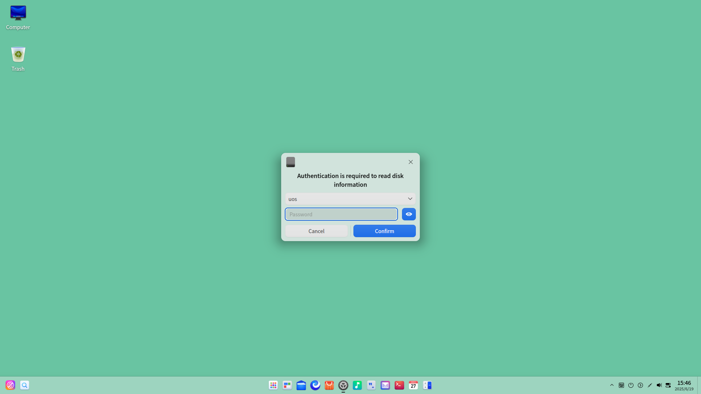
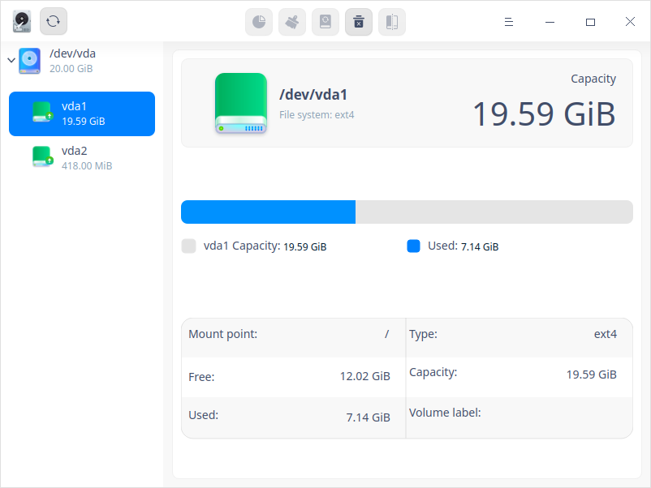
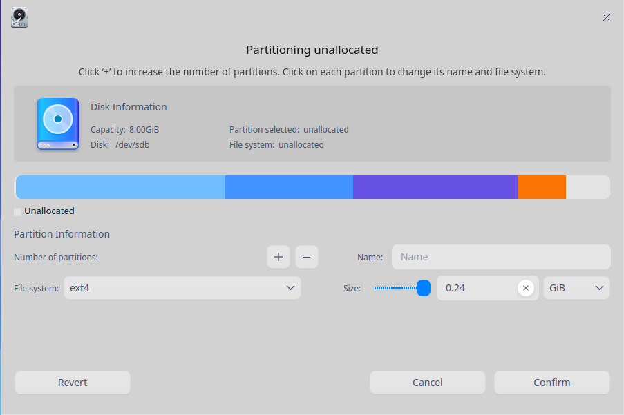
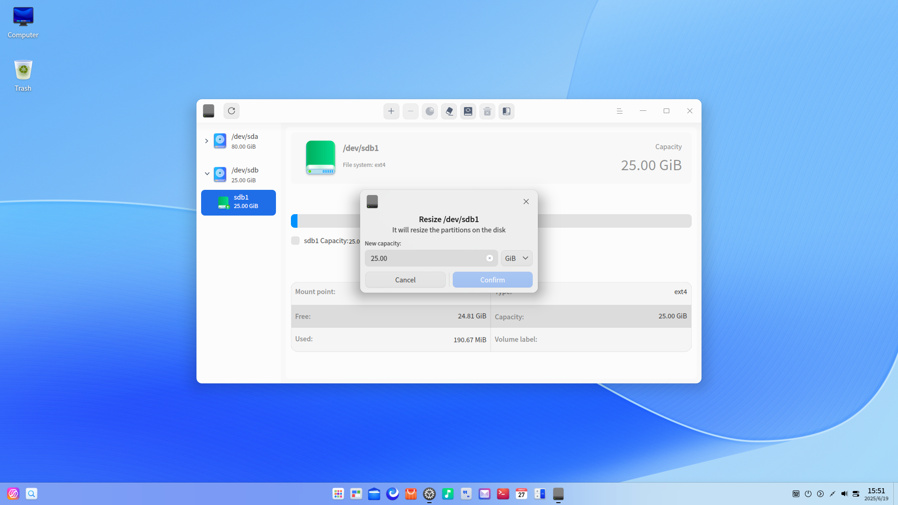
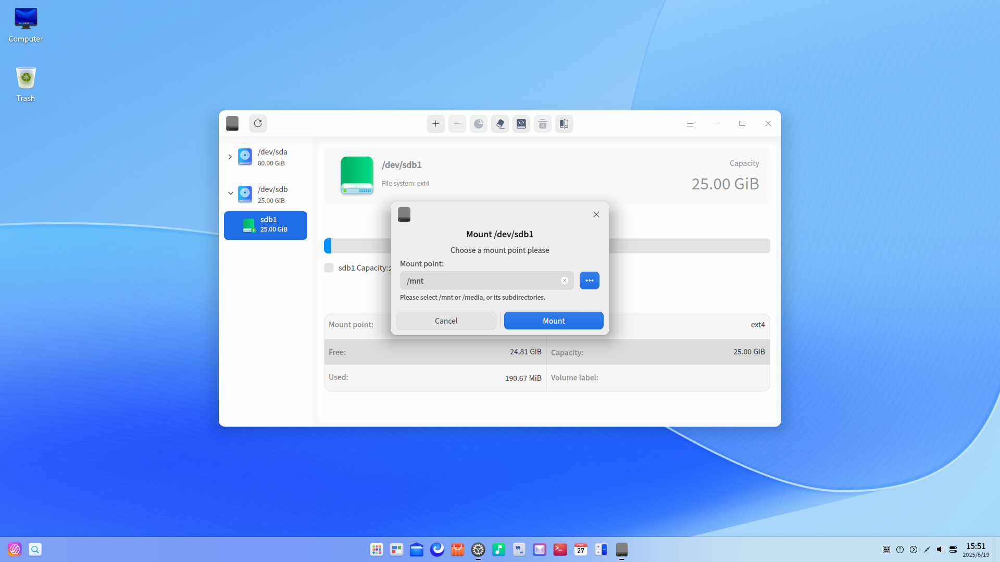
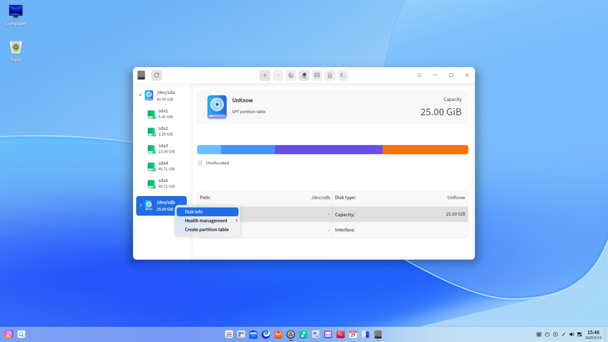
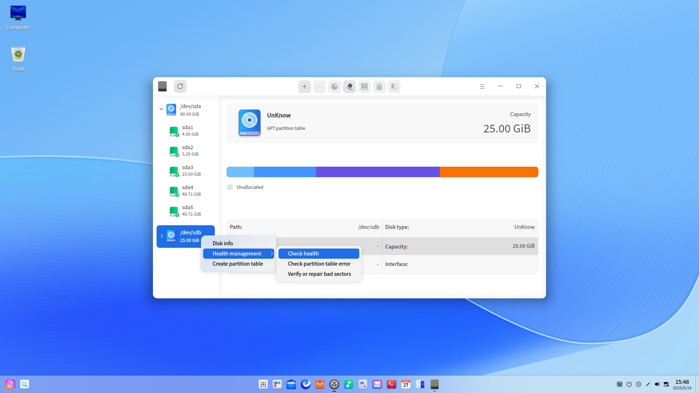

# Disk Utility|deepin-diskmanager|

## Overview

Disk Utility is a useful tool to help you better manage your disks through disk partitioning, disk data administration, and health management. 

## Guide

You can run, close, and create shortcuts for Disk Utility in the following ways.

### Run Disk Utility

1. Click  in the Dock and enter the Launcher interface.
2. Locate  by scrolling the mouse wheel or searching "disk utility" in the Launcher interface and click it to run. An authentication box pops up. Enter password for authentication. 

   

3. Right-click  to:

 - Click **Send to desktop** to create a desktop shortcut.
 - Click **Send to dock** to fix the application in the dock.
 - Click **Add to startup** to add the application to startup and it will automatically run when the system starts up.

### Exit Disk Utility

- On the Disk Utility interface, clickto exit Disk Utility.
- Right-click  in the dock and select **Close All** to exit Disk Utility.
- On the Disk Utility interface, click  and select **Exit** to exit Disk Utility.

## Disk Partitioning

On the Disk Utility interface, a list of disk(s) and information about relevant partition(s) are displayed, including format, capacity, and mount points of partitions. You can create, resize, format, mount, and unmount a partition.  Click the  icon to refresh the current interface.

### Create a Partition

1. On the Disk Utility interface, select an unallocated partition, and click the Partition icon  on the top toolbar.
2. A confirmation dialogue pops up. Click **Confirm** to enter the unallocated partitioning interface, where you can check the size, name, and file system of this partition, and read information of the disk where this partition locates. 
3. In the partition information area, fill in the name and size of partition, select file system of partition, and click the  icon. You can also create multiple partitions, and each partition name will be displayed on the bar graph under disk information. You can delete a partition by clicking the  icon when you're creating a new partition.

&nbsp;&nbsp;&nbsp;&nbsp;&nbsp;&nbsp;&nbsp;&nbsp;&nbsp;&nbsp;&nbsp;&nbsp;&nbsp;

>  Attention: It is available to create four msdos partitions at most.  While for gpt partitions, a maximum of 24 partitions can be created at one time and 128 partitions in total. To create a partition, you need a storage space of at least 52 MB. 

4. After setting up, click **Confirm**. The newly created partition will be displayed under the corresponding disk. 
5. The new partition will be automatically formatted when you create it. You can use the newly created partition after it's mounted. Please refer to [Mount a Partition](#Mount a Partition) for detailed information.

### Resize a Partition

You can resize a partition if the size is too small. Please note that you can only resize an unmounted partition.

1. On the Disk Utility interface, select an unmounted partition, and click the Resize icon  on the top toolbar.
2. A resizing interface pops up. Fill in the reserved size, and click **Confirm**. 

&nbsp;&nbsp;&nbsp;&nbsp;&nbsp;&nbsp;&nbsp;&nbsp;&nbsp;&nbsp;&nbsp;&nbsp;&nbsp;

3. You can check the capacity of partition once it's resized.

> Notes:  Only the partition adjacent to the idle partition can be resized and expanded.

## Disk Data Administration

### Format a Partition

Formatting a partition is normally executed to change the format of partitions, and will erase all data on the disk. Please proceed with caution as this action is irreversible. 

Notice that you can only format an unmounted partition which is not currently in use.

1. On the Disk Utility interface, select a partition and click the Format  icon on the top toolbar.
2. A formatting interface pops up. Fill in the name and select the file system. 

&nbsp;&nbsp;&nbsp;&nbsp;&nbsp;&nbsp;&nbsp;&nbsp;&nbsp;&nbsp;&nbsp;&nbsp;&nbsp;

3. Click **Format** to confirm. 

### Mount a Partition

1. On the Disk Utility interface, select an unmounted partition and click the Mount  icon on the top toolbar.
2. A mounting interface pops up. Select or create a mount point, and click **Mount** to confirm.

&nbsp;&nbsp;&nbsp;&nbsp;&nbsp;&nbsp;&nbsp;&nbsp;&nbsp;&nbsp;&nbsp;&nbsp;&nbsp;

>  Attention: A partition can be mounted to an existing directory and such directory can be not empty. However, once mounted, all previous files and contents under this directory will not be available. Please proceed with caution. 

### Unmount a Partition

If you want to change the mount point of a partition, you can unmount it first, and then mount it again.

1. On the Disk Utility interface, select a partition and click Unmount  icon on the top toolbar.

2. A confirmation dialogue pops up. Click **Unmount** if you confirm that there are no programs running on the partition.

   > Attention:  Unmounting the system disk may cause system crashes. Please proceed with caution. 

### Delete a Partition

Once a partition is deleted, you will lose all data in it. Please proceed with caution.

Please note that you can only delete an unmounted partition.

1. On the Disk Utility interface, select a partition and right-click it. 
2. Select **Delete partition** and a confirmation dialogue pops up. Click **Delete**, and this partition will disappear under the corresponding disk.

## Disk Health Management

### Check Disk Info

1. On the Disk Utility interface, select a disk. Right-click it and select **Disk info**.
2. You can check the serial number, device model, user capacity, rotation rate of the disk, etc.

&nbsp;&nbsp;&nbsp;&nbsp;&nbsp;&nbsp;&nbsp;&nbsp;&nbsp;&nbsp;&nbsp;&nbsp;&nbsp;

3. Click **Export** to export the disk info to your designated folder. 

### Run Health Management

#### Check Health

1. On the Disk Utility interface, select a disk. Right-click it and select **Health Management** > **Check health**. 
2. You can check the health status, current temperature, and status of different attributes of the disk.

&nbsp;&nbsp;&nbsp;&nbsp;&nbsp;&nbsp;&nbsp;&nbsp;&nbsp;&nbsp;&nbsp;&nbsp;&nbsp;

3. Click **Export** to export the health check results of the disk to your designated folder. 

#### Check Partition Table Error

1. On the Disk Utility interface, select a disk. Right-click it and select **Health Management** > **Check partition table error**. 
2. If there is no error in the partition table, a **No errors found in the partition table** prompt will pop up; if an error is found in the partition table, an **Errors in the partition table** report will pop up. 

#### Verify/Repair Bad Sectors

Bad sectors may occur commonly in disks, which need to be verified and repaired periodically. 

1. On the Disk Utility interface, right-click a disk and select **Health management** > **Verify or repair bad sectors**.

2. Set the range and method and click **Start Verify** to verify the selected disk.

   

3. Click **Stop** to stop the verification at any time and click **Continue** to resume the verification.

   

4. You can perform the following operations after the verification is completed.

- Exit the verification interface directly when no bad sector is detected. 
- Click **Repair** to repair the bad sectors detected.

> Attention: Bad sector repairing cannot recover files, but destroys data on and near bad sectors instead. Please back up all data before repair.

You can also click **Reset** to clear all the current data detected and enter the initial  **Verify or repair bad sectors** interface.

### Create Partition Table

- If the disk is normal but there is no partition table, it is unavailable to be operated. Therefore, please create a partition table in advance.
- If there is a partition table in the disk, e.g. MSDOS, it is available to switch to the GPT partition table after creating a partition table.

Please note that you need to unmount all the partitions in the disk before performing the operations above.

1. On the Disk Utility interface, right-click a disk and select **Create partition table**.
2. Select GPT or MSDOS partition and then click **Create**.

 Attention: All partitions in this disk will be merged and all data will be lost in the process of creating a new partition table. Please backup your data first.

## Main Menu

In the main menu, you can switch window themes, view help manual, and get more information about Disk Utility.

### Theme

The window theme provides three theme types, namely Light Theme, Dark Theme, and System Theme.

1.  On the Disk Utility interface, click .
2.  Click **Theme** to choose one theme.

### Help

1.  On the Disk Utility interface, click .
2.  Click **Help** to view the manual of Disk Utility.

### About

1.  On the Disk Utility interface, click .
2.  Click **About** to view the version and introduction of Disk Utility.

### Exit

1.  On the Disk Utility interface, click .
2.  Click **Exit** to exit Disk Utility.