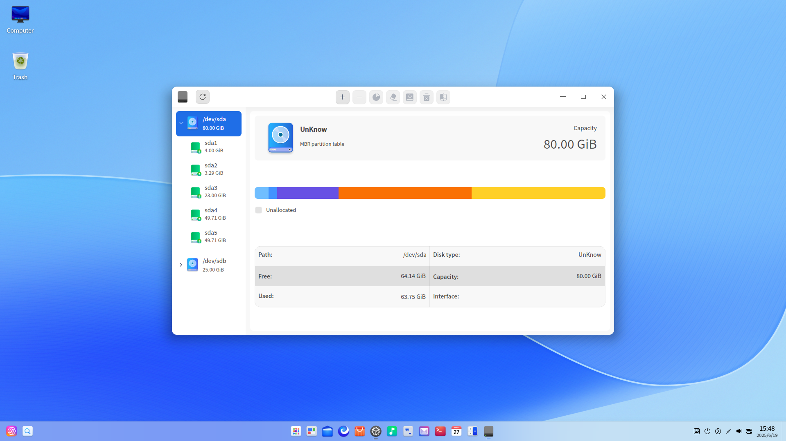
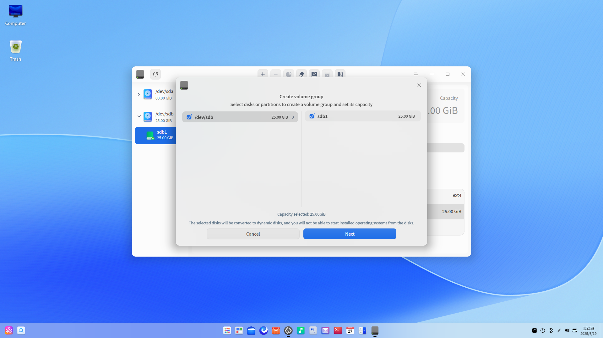
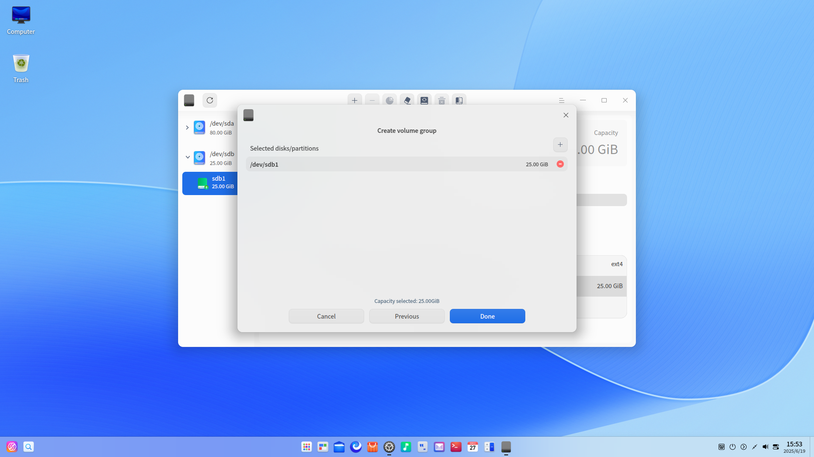
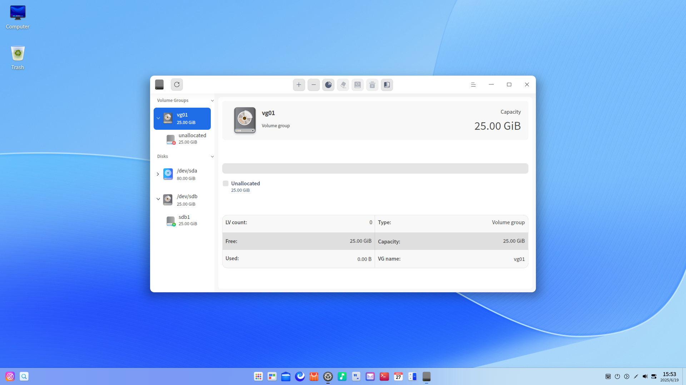
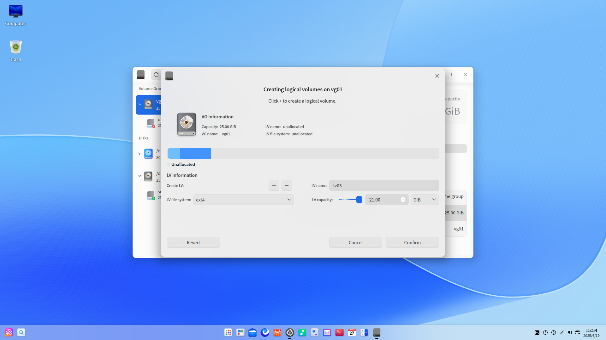
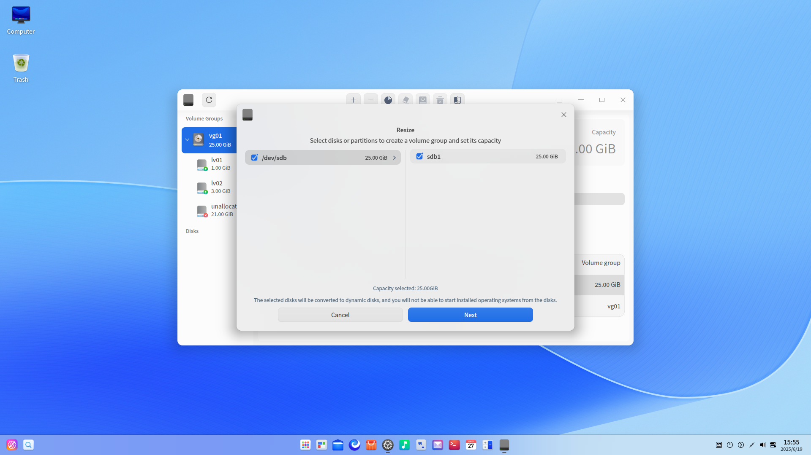

# Disk Utility|deepin-diskmanager|

## Overview

Disk Utility is a useful disk management tool,  which helps users to view the basic information of disks, create and manage logical volumes.

## Guide

You can run, exit, and create a desktop shortcut of Disk Utility as follows.

### Run Disk Utility

1. Click  in the Dock and enter the Launcher interface.
2. Locate  by scrolling the mouse wheel or searching for "Disk Utility" on the Launcher interface and click it to run. An authentication box pops up. Enter the password to open Disk Utility. 

   

3. Right-click , you can:

 - Click **Send to desktop** to create a desktop shortcut.
 - Click **Send to dock** to fix it in the Dock.
 - Click **Add to startup** to add it to startup and it will automatically run when the system starts up.

### Exit Disk Utility

- On the Disk Utility interface, clickto exit Disk Utility.
- Right-click  in the Dock and select **Close All** to exit Disk Utility.
- On the Disk Utility interface, click  and select **Exit** to exit Disk Utility.

## General Operations

### Disk Management

On the Disk Utility interface, you can view the disk info, perform health management and create partition tables, etc. As for the partitions, you can perform operations such as creating, resizing, wiping, mounting and unmounting partitions.

> Attention: 
>
>- Force quit during operation may cause abnormal performance of Disk Utility. Please proceed with caution.
>- If a partition of the system disk is an MBR extended partition, logical partition or logical volume, please proceed with caution to avoid system crashes.

#### View Disk Info

1. On the Disk Utility interface, a list of disk(s) and partition(s) are displayed. Click the  icon to refresh the current interface.
    

2. Right-click a disk and select **Disk info** to view the information such as model, vendor, media type, size, interface and so on.
   
   
3. Click **Export** to export the disk info to your designated folder. 

#### Create Partition Table

There are two cases for creating a partition table:

- The disk is normal but there is no partition table, it is unavailable to manage partitions. Therefore, you need to create a partition table.
- There is a partition table in the disk, e.g. MSDOS, which can be switched to the GPT partition table after creating a partition table.

Please note that you need to unmount all partitions in the disk before creating a partition table.

1. On the Disk Utility interface, right-click a disk and select **Create partition table**.
2. Select GPT or MSDOS and then click **Create**.

>  Attention: All partitions in this disk will be merged and all data will be lost in the process of creating a new partition table. Please back up your data first.   

#### Run Health Management

**Check Health**

1. On the Disk Utility interface, select a disk. Right-click it and select **Health management** > **Check health**. 
2. You can check the health status, current temperature, and status of different attributes of the disk.

&nbsp;&nbsp;&nbsp;&nbsp;&nbsp;&nbsp;&nbsp;&nbsp;&nbsp;&nbsp;&nbsp;&nbsp;&nbsp;

3. Click **Export** to export the health check results of the disk to your designated folder. 

**Check Partition Table Error**

1. On the Disk Utility interface, select a disk. Right-click it and select **Health management** > **Check partition table error**. 
2. If there is no error in the partition table, a "No errors found in the partition table" prompt will pop up; if an error is found in the partition table, an "Errors in the partition table" report will pop up. 

**Verify/Repair Bad Sectors**

Bad sectors may exist in disks, which should be verified and repaired periodically. 

1. On the Disk Utility interface, right-click a disk and select **Health management** > **Verify or repair bad sectors**.

2. Set the range and method and click **Start Verify** to verify the selected disk.

   

3. Click **Stop** to stop the verification at any time and click **Continue** to resume the verification.

   

4. You can perform the following operations after the verification is completed.

- Exit the verification interface directly when no bad sector is detected. 
- Click **Repair** to repair the bad sectors.

>  Attention: Bad sector repairing may destroy data on and near bad sectors instead. Please back up all data before repair.

You can also click **Reset** to clear the detected result.

#### Create a Partition

1. On the Disk Utility interface, select an unallocated partition, and click the Partition icon  on the top toolbar.
2. A confirmation dialogue pops up. Click **Confirm** to enter the partitioning interface, where you can view the size, name, and file system of this partition, and get the disk where this partition locates. 
3. In the Partition Information area, fill in the name and size of new partition, and select its file system. Currently AES / SM4 encryption is supported.

   - No encryption: the space for new partition must be larger than 52 MiB.
   - AES/SM4 encryption: the space for new partition must be larger than 100 MiB. The system disk can't be encrypted.

>  Attention: It is available to create four MSDOS partitions at most. While for GPT partitions, a maximum of 24 partitions can be created at one time and 128 partitions in total. 

4. Click the  icon to add the new partition. If encrypted, set up a password in the pop-up window, and click **Confirm**. 

   - The password can't be reset or retrieved online, please save it properly.
   - The password should be 1~256 characters containing English letters, numbers and symbols.
   - Password hint: it can be at most 50 characters, and not identical to the password.

5. The newly-created partition will be displayed in segments on the bar chart. You can create several partitions. Click a partition on the bar chart and click the  icon to delete it.

6. Click **Confirm** after you complete the operations. The newly-created partition will be displayed under the corresponding disk.  
7. The new partition is automatically formatted when you create it. You should manually mount the newly-created partition before using it. Please refer to [Mount a Partition](#Mount a Partition) for detailed information.

> Notes: You should unlock new partitions before mounting them if they are AES/SM4 encrypted. The system that does not support State Cryptographic Algorithm is not able to unlock the SM4 encrypted partition.

#### Resize a Partition

Please note that you can only resize an unmounted, unencrypted partition.

1. On the Disk Utility interface, select an unmounted partition, and click the Resize icon  on the top toolbar.
2. A resizing interface pops up. Fill in the new capacity.

   - Expand space: It supports downward expansion currently. Only when there is an unallocated partition downward next to the selected partition, can you expand space,  and the new capacity cannot be greater than the total capacity of the current partition and the unallocated partition. Otherwise, it is unavailable to expand space for the partition.
   - Shrink space: Please back up your data before the operation.

3. Click **Confirm**. You can view the capacity of the partition once it's resized.

> Notes:  Partitions with the FAT32 file system cannot be shrunk. Partitions with XFS, Btrfs, and exFAT file systems cannot be resized.

#### Wipe a Disk/Partition

It is available to wipe unmounted disks and partitions, and change the encrypted file system to unencrypted ones by wiping.

1. On the Disk Utility interface, select a disk or partition and click the Wipe  icon on the top toolbar.
2. A wiping interface pops up. Fill in the name, select the file system and security option. AES/SM4 encryption is supported. There are three security options, namely Fast, Secure and Advanced, with the Fast option as the default.
   - Fast:  It only deletes the partition info without erasing the files on the disk. Disk recovery tools may recover the files with a certain probabality.
   - Secure: It is a one-time secure wipe that complies with NIST 800-88 and writes 0, 1, and random data to the entire disk once. You will not be able to recover files, and the process will be slow.
   - Advanced: There are two wiping methods, namely DoD 5220.22-M and Gutmann. It writes 0, 1, and random data to the entire disk several times. You can set the number of times to wipe disks and overwrite data, but the process will be very slow.

>  Notes: The DoD 5220.22-M and Gutmann wiping methods are not available for solid state drives (SSD). When it is SSD, there are only Fast and Secure options in the Security dropdown list.

3. Click **Wipe**. If you have chosen to encrypt, you need to set up a password. The wiped partition will be mounted automatically. 

#### Mount a Partition

If AES/SM4 encrypted partitions are unmounted, you need to unlock them before mounting again. The system that does not support State Cryptographic Algorithm is not able to unlock the SM4 encrypted partition.

1. On the Disk Utility interface, select an unmounted partition and click the Mount  icon on the top toolbar.
2. A mounting interface pops up. Select or create a mount point, and click **Mount**.

   

>  Attention: A partition can be mounted to an existing directory and such directory can be not empty. However, once mounted, all files and contents under this directory will not be available. Please proceed with caution. 

#### Unmount a Partition

If you want to change the mount point of a partition, you can unmount it first, and then mount it again.

1. On the Disk Utility interface, select a partition and click the Unmount  icon on the top toolbar.

2. A confirmation dialogue pops up. Click **Unmount** if you confirm that there are no programs running on the partition.

   > Attention:  Unmounting the system disk may cause system crashes. Please proceed with caution. 

#### Delete a Partition

Once a partition is deleted, you will lose all data in it. Please proceed with caution.

1. On the Disk Utility interface, select an unmounted partition and right-click it. 
2. Select **Delete partition** and a confirmation dialogue pops up. Click **Delete**, and this partition will disappear from the corresponding disk.

### Logical Volume Manager

Logical volume manager is a logical layer based on the disk and partition. With it, you can create and manage logical volumes rather than use the physical hard disk directly, thereby improving the flexibility of disk and partition management.

#### Create a Volume Group

1. On the Disk Utility interface, click the "Create volume group" icon on the top toolbar. A confirmation dialogue pops up. Creating a logical volume will format the file system of the original partition. Please back up the data first.

2. Click **Confirm** to enter the "Create volume group" interface, where you can view the name and capacity of the disks and partitions available. The disks and partitions that are not shown include the following:

   - The disk where the boot partition is located
   - Read-only disks
   - Partitions or disks that are added to other logical volumes
   - Mounted partitions
   - Unallocated partitions that cannot used to create new partitions
   - Disks with partition table errors
   - Partitions or disks with a capacity of less than 100 MiB

   

3. Select the disk and partition, click **Next**. 

4. In the "Create volume group" interface, the selected disks or partitions will be displayed at the top. Click the delete button  to remove a disk or partition, click the add button  to add it again. When the selected partition is an idle partition or there is no partition table for the selected disk, the range of setting volume group's space will be displayed at the bottom. You can customize the space within the range.

   

5. Click the **Done** button to finish creating the volume group. The newly-created volume group is displayed on the left panel with the default name of vg01, vg02, etc.

   

#### Create a Logical Volume

1. On the Disk Utility interface, select an unallocated logical volume or a volume group with an unallocated logical volume, and click the "Create logical volume" icon  on the top toolbar.
2. A confirmation dialogue pops up. Click **Confirm** to enter the creating logical volumes interface, where you can view the size, name, file system of this volume and other information. 
3. In the creating logical volumes interface, fill in the size of volume, and select the LV file system. AES/SM4 encryption is supported currently. 

   - No encryption: the space for new logical volume must be larger than 4 MiB, and is a positive integer multiple of 4 Mib.
   - AES/SM4 encryption: the space for new logical volume must be larger than 100 MiB. 

4. Click the  icon to add the logical volume. If encrypted, set up a password in the pop-up window, and click **Confirm**. 

   - The password can't be reset or retrieved online, please save it properly.
   - The password should be 1~256 characters containing English letters, numbers and symbols.
   - Password hint: it can be at most 50 characters, and not identical to the password.

5. The newly-created logical volume will be displayed in segments on the bar chart. You can create several logical volumes. Click a logical volume on the bar chart and click the  icon to delete it.

6. Click **Confirm** after you complete the operations. The new logical volume will be automatically formatted and mounted when you create it. 
7. The newly-created logical volume will be displayed under the corresponding logical volume group. 

> Notes: You should unlock logical volumes before mounting them if they are AES/SM4 encrypted. The system that does not support State Cryptographic Algorithm is not able to unlock the SM4 encrypted logical volumes.

#### Resize a Volume Group/Logical Volume

It is available to resize a volume group or logical volume according to the actual needs. Please back up your data before shrinking the volume group or logical volume.

Please refer to [Resize a Partition](#Resize a Partition) in the Disk Management section for the detailed operations of resizing a logical volume.  Please note that logical volumes with the FAT32 file system cannot be resized.

Please refer to the following steps for resizing a volume group:

1. On the Disk Utility interface, select a volume group, and click the Resize icon  on the top toolbar.

2. A resizing interface pops up with all available disks and partitions displayed. You can choose to expand or shrink the space.

   

   

3. Select the corresponding disks and partitions and click the **Next** icon.
4. The selected disks or partitions will be displayed on top of the resizing interface.  Click  or  to add or remove a disk or partition respectively. When the selected partition is an idle partition or there is no partition table for the selected disk, the range of setting volume group's space will be displayed at the bottom. You can customize the space within the range.

5. Click the **Done** button to finish resizing the volume group.

#### Wipe a Logical Volume

Wiping a logical volume is similar with wiping a disk or partition. Please refer to [Wipe a Disk/Partition](#Wipe a Disk/Partition) in the Disk Management section.

#### Mount a Logical Volume

Mounting a logical volume is similar with mounting a partition. Please refer to [Mount a Partition](#Mount a Partition) in the Disk Management section.

#### Unmount a Logical Volume

Unmounting a logical volume is similar with unmounting a partition. Please refer to [Unmount a Partition](#Unmount a Partition) in the Disk Management section.

#### Delete a Logical Volume

The data cannot be recovered after a logical volume is deleted. Please proceed with caution.

Prerequisites: The logical volume is unmounted.

1. Select an unmounted logical volume and right-click to choose **Delete logical volume** or click the  icon on the top toolbar.

2. Click the **Delete** button and the capacity of the deleted logical volume will be released to the unallocated logical volume in the volume group.

#### Delete a Volume Group

The data cannot be recovered after a volume group is deleted. Please proceed with caution.

Prerequisites: Please make sure that all the logical volumes under the volume group are unmounted before deleting it.

1. Select a volume group and right-click to choose **Delete volume group** or click the  icon on the top toolbar.
2. Click the **Delete** icon to delete it.

#### Delete a Physical Volume

1. Select a disk or partition that has been added to the logical volume group and click  the  icon on the top toolbar.
2. The data contained will be lost after deleting the physical volume. Please proceed with caution. Click the **Delete** button after confirmation.
3. The physical volume can be deleted if its space is no more than the remaining space of the volume group. Otherwise, it cannot be deleted. It is recommended to delete the corresponding logical volume first, and then delete the physical volume.

## Main Menu

In the main menu, you can switch window themes, view the manual, and get more information about Disk Utility.

### Theme

There are three window themes, namely Light Theme, Dark Theme, and System Theme.

1.  Click  On the Disk Utility interface.
2.  Click **Theme** to choose one theme.

### Help

1.  Click  On the Disk Utility interface.
2.  Click **Help** to view the manual of Disk Utility.

### About

1.  Click  On the Disk Utility interface.
2.  Click **About** to view the version and introduction of Disk Utility.

### Exit

1.  Click  On the Disk Utility interface.
2.  Click **Exit** to exit Disk Utility.