# 磁盘管理器|deepin-diskmanager|

## 概述

磁盘管理器是一款管理磁盘的工具，可以帮助用户快速的查看硬盘中各个分区的基本信息，还可以创建并管理逻辑卷。

## 使用入门

您可以通过以下方式运行或关闭磁盘管理器，或者创建快捷方式。

### 运行磁盘管理器

1. 单击任务栏上的启动器图标 ，进入启动器界面。

2. 上下滚动鼠标滚轮浏览或通过搜索，找到磁盘管理器图标 ，单击运行。弹出授权框，需要输入系统登录密码进行认证。

   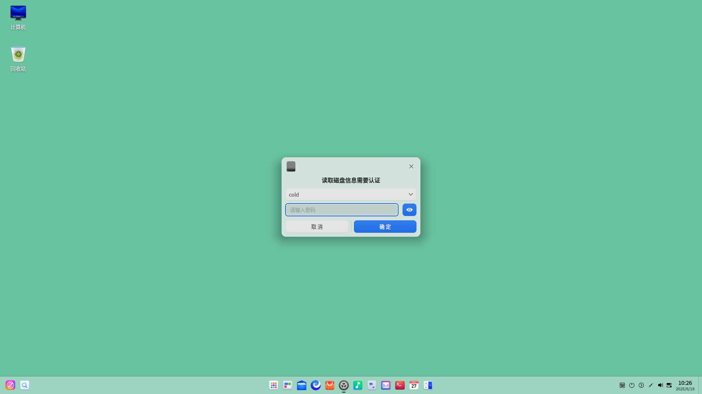

3. 右键单击  ，您可以：
   - 单击 **发送到桌面**，在桌面创建快捷方式。

   - 单击 **发送到任务栏**，将应用程序固定到任务栏。

   - 单击 **开机自动启动**，将应用程序添加到开机启动项，在电脑开机时自动运行该应用程序。

### 关闭磁盘管理器

- 在磁盘管理器界面，单击   ，退出磁盘管理器。
- 右键单击任务栏上的 ，选择 **关闭所有** 来退出磁盘管理器。
- 在磁盘管理器界面单击  ，选择 **退出** 来退出磁盘管理器。

## 操作介绍

### 磁盘管理

打开磁盘管理器，可以查看磁盘信息、健康状态，新建分区表等。对于分区，则可以新建分区、调整分区空间、擦除、挂载及卸载分区等。

> 注意：

- 在操作的过程中如果强制退出磁盘管理器，可能会导致磁盘管理器异常，请谨慎操作。

- 如果系统盘某分区为mbr扩展分区、逻辑分区或逻辑卷，请谨慎对此分区进行操作，以免引起系统崩溃。

#### 磁盘信息

1. 在磁盘管理器界面，左侧边栏显示磁盘列表及分区信息。单击刷新按钮，可以刷新当前页面信息。

   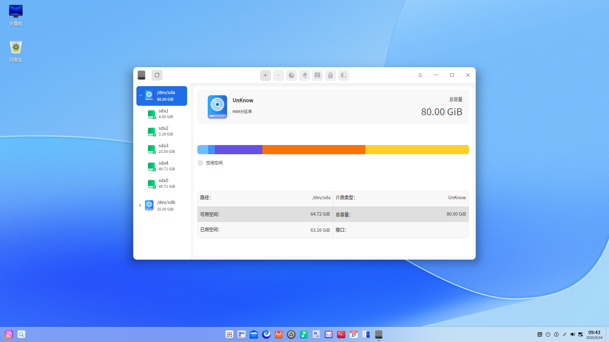

2. 选中磁盘后单击右键，选择 **磁盘信息**，可以查看磁盘的型号、制造商、介质类型、大小、接口等信息。

   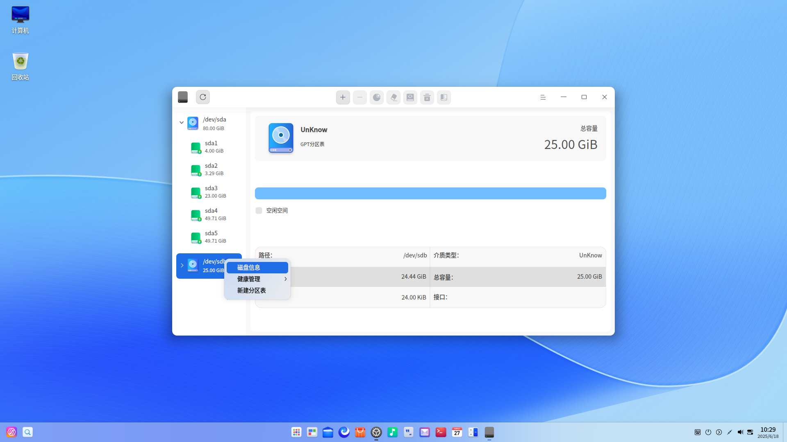

3. 单击 **导出**，还可以将磁盘信息导出到指定的文件夹。

#### 新建分区表

新建分区表有两种情况：

- 当前磁盘是正常的但是无分区表，则无法对分区进行操作，新建分区表后就可以执行对该分区的操作。
- 当前磁盘有分区表，如MSDOS分区表，新建分区表后可以切换为GPT分区表。

使用前提：卸载该磁盘中的所有分区。

1. 在磁盘管理器界面，选中磁盘，并单击右键，选择 **新建分区表**。
2. 选择GPT或MSDOS磁盘分区后，单击 **新建** 即可。

>  注意：新建分区表后将会合并当前磁盘所有分区，丢失所有数据，请先做好数据备份。

#### 健康管理

**硬盘健康检测**

1. 在磁盘管理器界面，选中磁盘，并单击右键，选择 **健康管理 > 硬盘健康检测** 。

2. 可查看磁盘的健康状态是否良好，当前的温度及各属性的状态。

   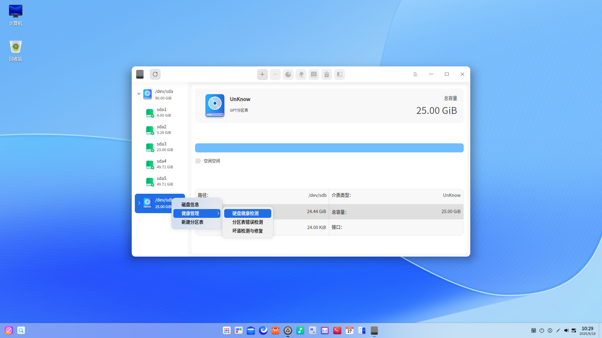

3. 单击 **导出**，还可以将硬盘健康检测信息导出到指定的文件夹。

**分区表错误检测**

1. 在磁盘管理器主界面，选中磁盘，并单击右键，选择 **健康管理 > 分区表错误检测** 。
2. 若分区表没有错误，则弹出 “分区表检测正常” 提示；若分区表有错误，会弹出错误报告。

**坏道检测与修复**

磁盘坏道是磁盘使用过程中常见的问题，需要定期检测与修复。

1. 在磁盘管理器主界面，选中磁盘，并单击右键，选择 **健康管理 > 坏道检测与修复** 。

2. 在坏道检测与修复界面，可以设置检测范围和检测方式，然后单击 **开始检测**。

   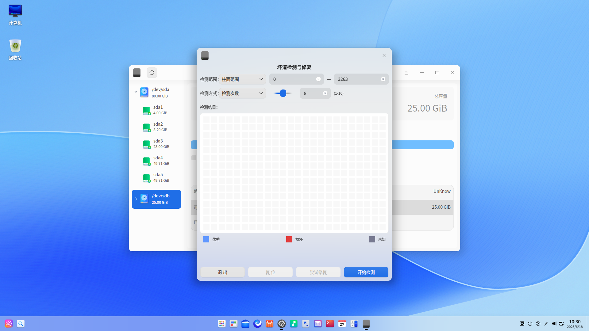

3. 在检测过程中，单击 **停止** 随时停止对应的磁盘检测，再单击 **继续** 后，继续对应的磁盘检测。

   

4. 检测完成后，可根据检测结果做以下操作。

   无坏道：可以直接退出检测界面。

   有坏道：单击 **尝试修复** 进行坏道修复。

   >  注意：修复坏磁道会破坏坏磁道及其附近磁道上的文件数据，请先做好数据备份。

还可以单击 **复位**，清空现有的所有磁盘检测数据，显示刚开始进入磁盘时的状态。

#### 新建分区

1. 在磁盘管理器界面，选中未分配的分区，并在顶部功能栏单击新建分区按钮 。

2. 弹出确认框，单击 **确定** 后进入分区操作界面，可以查看分区总容量、名称、格式及所属的磁盘信息。

3. 在分区信息区域填写新分区名称、分区大小，并选择分区格式，当前支持AES/SM4文件加密。

   - 不加密：创建新分区的空间必须大于52 MiB，否则无法创建。

   - AES/SM4文件加密：创建新分区的空间必须大于100MiB，系统盘不可进行加密。

   > 注意：MSDOS分区最多只能创建4个分区；GPT分区最多一次性创建24个分区，最多可创建128个分区。

   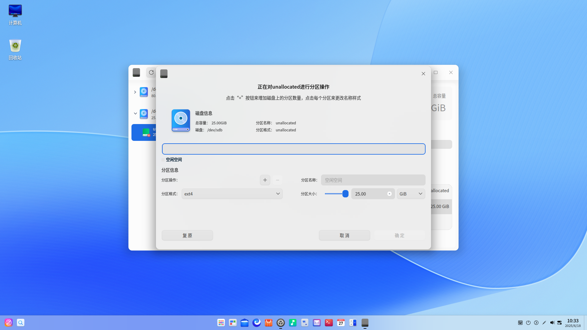

4. 如果选择了文件加密，单击增加按钮 ，弹出设置密码窗口。输入密码和密码提示，单击 **确定**。

   - 密码不可重置，也不可在线找回，请自行备份。
   - 密码：密码长度为1～256个字符，由英文、数字或符号组成
   - 密码提示：最多可以输入50个字符，且不可与密码完全一致。

   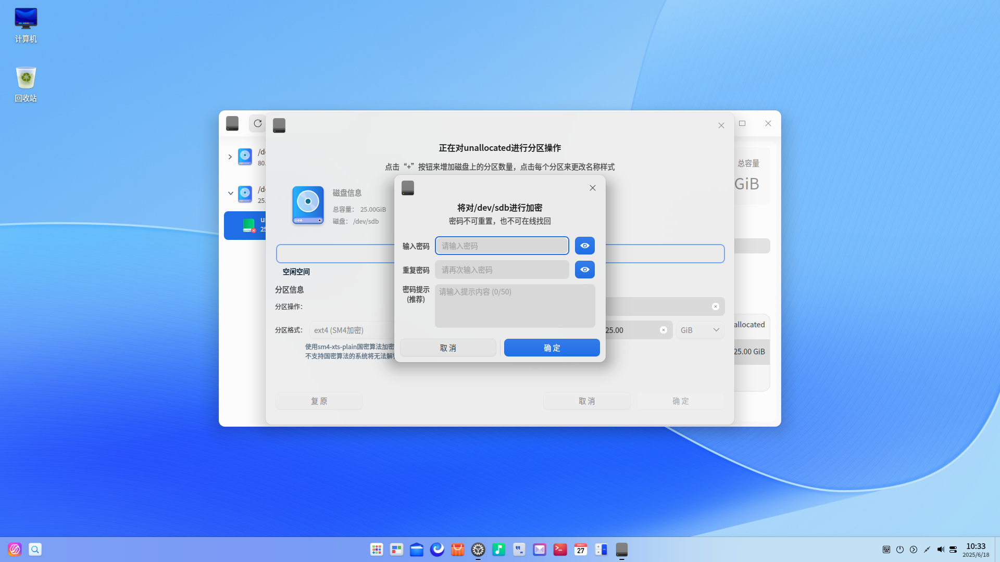

3. 新建的分区会分段显示在条形图中，可以新建多个分区。选中某个分区，单击删除按钮 ，则可以删除分区。

   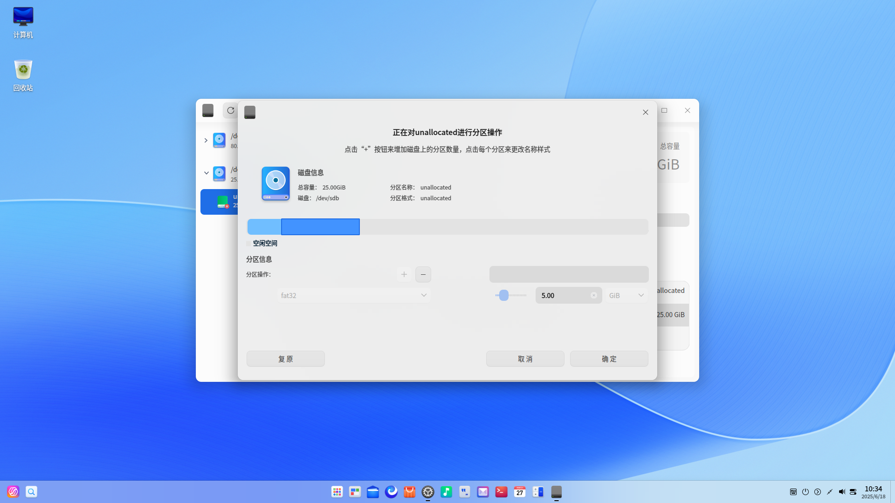

4. 操作完后单击 **确定** ，新建的分区会显示在对应磁盘下。

7. 在新建分区的过程中会自动格式化该分区。若要正常使用新建分区，还需要手动挂载，详细操作请参考 [挂载分区](#挂载分区) 。

   > 说明：如果新建的分区使用了AES/SM4加密，需要解锁后才能挂载。对于SM4加密的分区，不支持国密算法的系统将无法解锁。

#### 空间调整

对于未加密、卸载状态的分区，可以进行空间调整。

1. 在磁盘管理器界面，选中卸载状态的分区，并在顶部功能栏单击空间调整按钮  。

2. 弹出空间调整窗口，填写调整后的空间大小。

   - 扩展空间：当前支持向下扩展空间，如果选中的分区下面相邻的是空闲分区，则扩展后的空间不能大于当前空间和空闲分区之和。如果选中的分区下面无空闲分区，则无法扩展。

   - 压缩空间：建议先对分区数据进行备份再进行操作。

   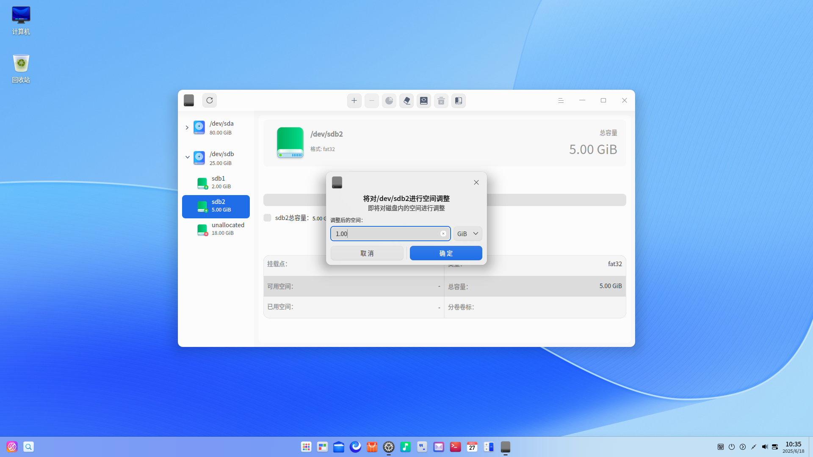

3. 单击 **确定** ，可以查看空间调整后的分区。

>  说明：FAT32文件系统不支持压缩空间。

#### 擦除磁盘或分区

对于卸载状态的磁盘或分区，可以进行擦除操作。通过擦除的方式将加密的文件系统修改为非加密文件系统。

1. 在磁盘管理器界面，选中一个磁盘或分区，并在顶部功能栏单击擦除按钮  。

2. 弹出擦除操作窗口，填写分区名称、分区格式和安全选择。其中分区格式支持AES/SM4加密，安全选择有快速、安全、高级三个选项，默认为 “快速”。

   - 快速：仅擦除原文件系统标记，真正的数据会保留在磁盘上，通过磁盘恢复工具可能会恢复数据。

   - 安全：符合 NIST 800-88 的1次安全擦除。它会在整个磁盘中写入0、1和随机数据一次，擦除后将无法恢复磁盘上的文件，且处理过程较慢。

   - 高级：提供两种磁盘擦除处理标准，分别为DoD 5220.22-M和Gutmann。会多次将0、1和随机数据写到整个磁盘。您可以定义擦除磁盘并改写数据的次数，处理过程会非常缓慢。

   > 说明：由于DoD 5220.22-M和Gutmann数据擦除标准不支持擦除固态硬盘（SSD），所以如果设备类型为固态硬盘（SSD）时，安全选择下拉框仅显示快速和安全两个选项。

   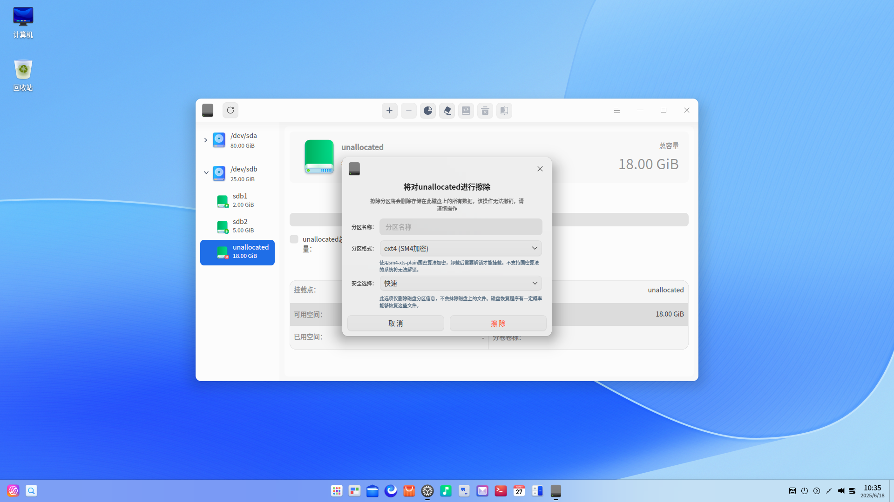

3. 单击 **擦除**。如果选择了加密，则需要设置密码，擦除完成后会自动挂载。

#### 挂载分区

AES/SM4加密的分区，卸载后需要解锁才能挂载。对于SM4加密的分区，不支持国密算法的系统将无法解锁。

1. 在磁盘管理器界面，选中未挂载的分区，并在顶部功能栏单击挂载按钮  。

2. 弹出挂载操作窗口，选择或创建挂载点后，单击 **挂载** 即可。

   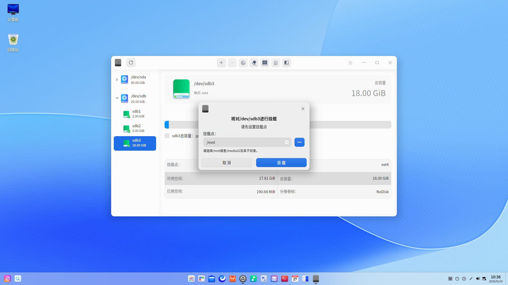

> 注意：一个分区挂载在一个已存在的目录上，这个目录可以不为空，但挂载后这个目录下以前的内容将不可用，请谨慎操作。

#### 卸载分区

若要修改分区的挂载点，可先卸载，再重新挂载。

1. 在磁盘管理器界面，选中一个分区，并在顶部功能栏单击卸载按钮   。
2. 弹出确认框，确认无正在运行的程序后，单击 **卸载**  即可。

>  注意：卸载系统盘可能会引起系统崩溃，请谨慎操作。

#### 删除分区

删除分区后，该分区中的所有文件都会丢失，请谨慎操作。

1. 在磁盘管理器界面，选中一个处于卸载状态的分区，并单击右键。
2. 选择 **删除分区** 后弹出确认框，单击 **删除**，该分区在对应磁盘下消失。

### 逻辑卷管理

逻辑卷管理是建立在磁盘和分区之上的一个逻辑层，可以创建和管理逻辑卷，而不是直接使用物理硬盘，从而提高磁盘分区管理的灵活性。

#### 创建逻辑卷组

1. 在磁盘管理器界面，单击创建逻辑卷组按钮，弹出提示窗口。创建逻辑卷会对原分区文件系统格式化，请先做好数据备份。

2. 单击 **确定**，弹出创建逻辑卷组窗口，显示所有可用的磁盘和分区，不显示的磁盘和分区包括：

   - 启动分区所在磁盘
   - 只读模式的磁盘

   - 已加入其他逻辑卷的磁盘或分区

   - 已经挂载的分区
   - 不能创建新分区的磁盘空闲空间

   - 分区表错误的磁盘
   - 小于100MiB空间的磁盘或分区

   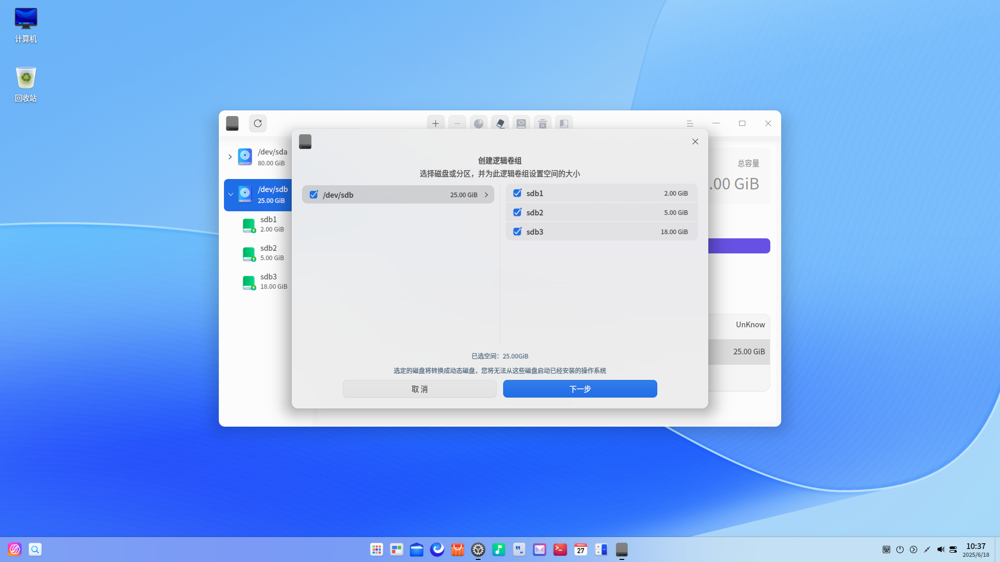

3. 自行选择磁盘和分区后，单击 **下一步**。

4. 在创建逻辑卷组界面，顶部会显示已选择的磁盘或分区，单击删除按钮可以移除磁盘或分区，单击添加按钮则可以再次添加。当所选分区为空闲分区或者所选磁盘不存在分区表时，底部则会显示设置卷组空间的范围，可以在设置范围内自定义空间。

   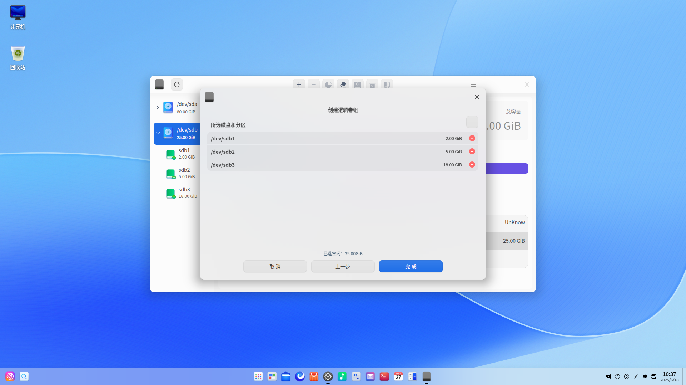

5. 单击 **完成**，新创建的逻辑卷组会显示在左侧边栏，默认名称为vg01、vg02，依次类推。

   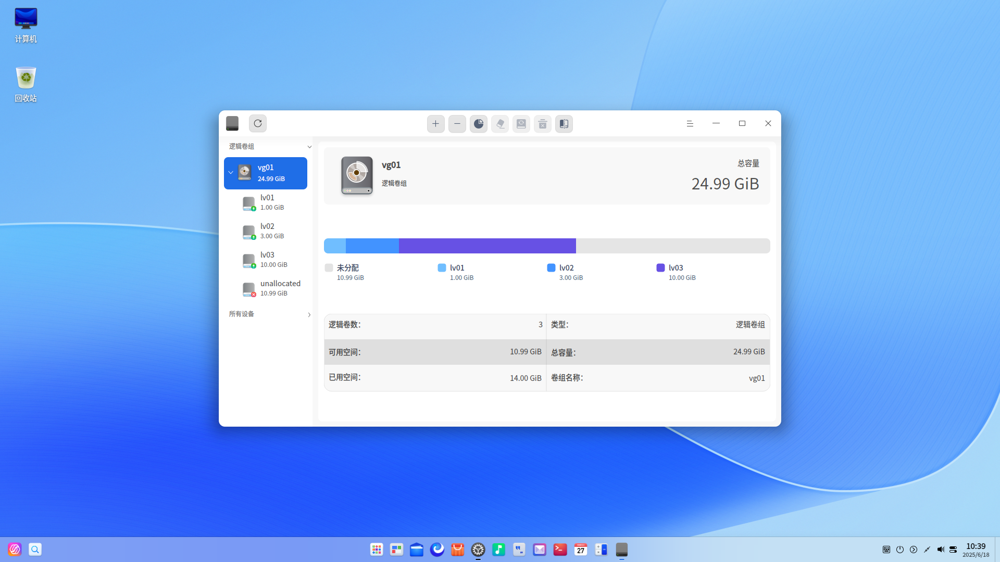

#### 创建逻辑卷

1. 选中一个有空闲空间的逻辑卷组，并在顶部功能栏单击创建逻辑卷按钮 。

2. 弹出确认框，单击 **确定** 后进入创建逻辑卷界面，可以查看卷组总容量、名称等信息。

3. 在逻辑卷信息区域填写逻辑卷大小，并选择逻辑卷格式，当前支持AES/SM4文件加密。

   - 不加密：创建逻辑卷的空间不得小于4 MiB，且为4MiB的正整数倍。
   - AES/SM4加密：创建逻辑卷的空间必须大于100MiB。
   
3. 如果选择了文件加密，单击增加按钮 ，弹出设置密码窗口。输入密码和密码提示，单击 **确定**。

   - 密码不可重置，也不可在线找回，请自行备份。
   - 密码：密码长度为1～256个字符，由英文、数字或符号组成。
   - 密码提示：最多可以输入50个字符，且不可与密码完全一致。

3. 新建的逻辑卷会分段显示在条形图中，可以新建多个逻辑卷。选中某个逻辑卷，单击删除按钮 ，则可以删除逻辑卷。

   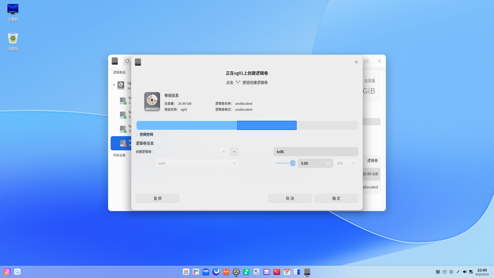

4. 操作完后单击 **确定** ，在创建的过程中会进行格式化并自动挂载。

7. 新建的逻辑卷会显示在对应逻辑卷组下。

   > 说明：如果新建的逻辑卷使用了AES/SM4加密，需要解锁后才能挂载。对于SM4加密的逻辑卷，不支持国密算法的系统将无法解锁。

#### 空间调整

结合使用需求，可以对逻辑卷和逻辑卷组进行空间调整，压缩空间前建议先进行数据备份。

逻辑卷空间调整详细操作请参考磁盘管理的 [空间调整](#空间调整)，FAT32格式的逻辑卷和加密逻辑卷不支持空间调整。

逻辑卷组空间调整操作如下所示：

1. 选中一个逻辑卷组，并在顶部功能栏单击空间调整按钮  。

2. 弹出空间调整窗口，显示当前已有、可用的磁盘和分区，可以选择扩展或压缩空间。

   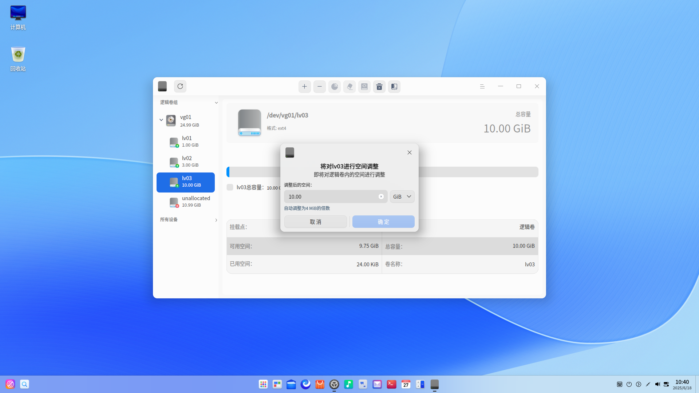

3. 勾选或去勾选对应的磁盘和分区后，单击 **下一步**。

4. 在空间调整界面，顶部会显示已选择的磁盘或分区，单击删除按钮可以移除磁盘或分区，单击添加按钮则可以再次添加。当所选分区为空闲分区或者所选磁盘不存在分区表时，底部则会显示设置卷组空间的范围，可以在设置范围内自定义空间。

   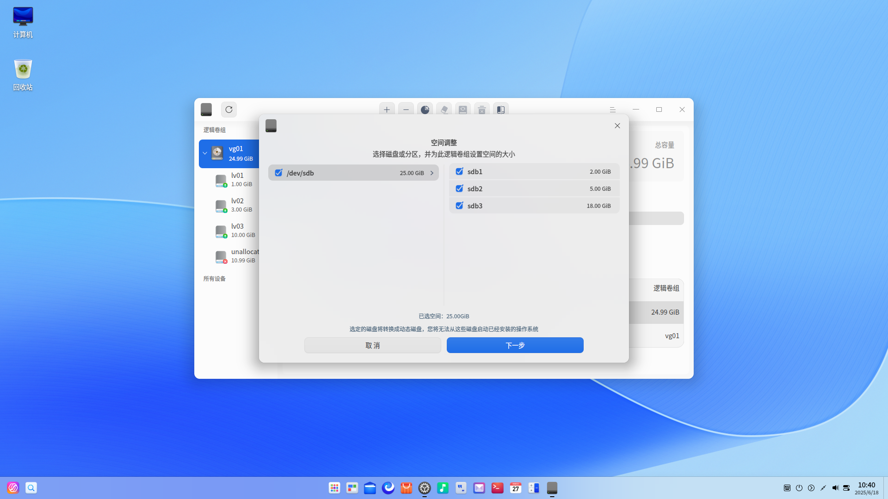

5. 单击 **完成**，可以查看空间调整后的逻辑卷组。

#### 擦除逻辑卷

擦除逻辑卷与擦除分区操作类似，详细操作请参考磁盘管理的 [擦除磁盘或分区](#擦除磁盘或分区)。

#### 挂载逻辑卷

挂载逻辑卷与挂载分区操作类似，详细操作请参考磁盘管理的 [挂载分区](#挂载分区)。

#### 卸载逻辑卷

卸载逻辑卷与卸载分区操作类似，详细操作请参考磁盘管理的 [卸载分区](#卸载分区)。

#### 删除逻辑卷

删除后数据将无法恢复，请谨慎操作。

使用前提：逻辑卷处于卸载状态。

1. 选中一个逻辑卷，单击右键并选择 **删除逻辑卷**，或单击顶部功能栏的删除按钮。
2. 确认后，单击 **删除**，删除的逻辑卷空间会被合入到所属逻辑卷组中的空闲空间。

#### 删除逻辑卷组

删除后数据将无法恢复，请谨慎操作。

使用前提：该逻辑卷组下的所有逻辑卷处于卸载状态。

1. 选中一个逻辑卷组，单击右键并选择 **删除逻辑卷组**，或单击顶部功能栏的删除按钮。
2. 确认后，单击 **删除**。

#### 删除物理卷

1. 对于已添加到逻辑卷组的磁盘或分区，选中需要删除的对象，单击顶部功能栏的删除按钮。
2. 删除物理卷后，其包含的所有文件将会丢失，请谨慎操作。确认后，单击 **删除**。
3. 如果逻辑卷组中剩余的空间不小于待删除的物理卷空间，可以正常删除。如果逻辑卷组中剩余的空间小于待删除的物理卷空间，则无法正常删除。建议先删除对应的逻辑卷，再选择删除物理卷。

## 主菜单

在主菜单中，可以切换窗口主题，查看帮助手册等。

### 主题

窗口主题包含浅色主题、深色主题和系统主题。

1. 在磁盘管理器界面，单击。
2. 单击 **主题**，选择一个主题颜色。

### 帮助

1. 在磁盘管理器界面，单击 。
2. 单击 **帮助**，查看帮助手册，进一步了解和使用磁盘管理器。

### 关于

1. 在磁盘管理器界面，单击 。
2. 单击 **关于**，查看磁盘管理器的版本和介绍。

### 退出

1. 在磁盘管理器界面，单击 。
2. 单击 **退出**。

