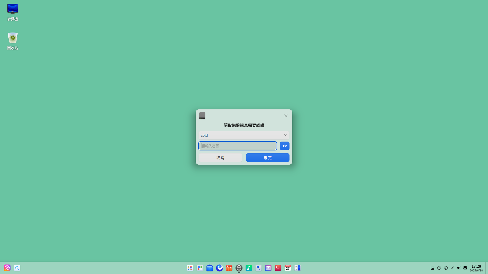
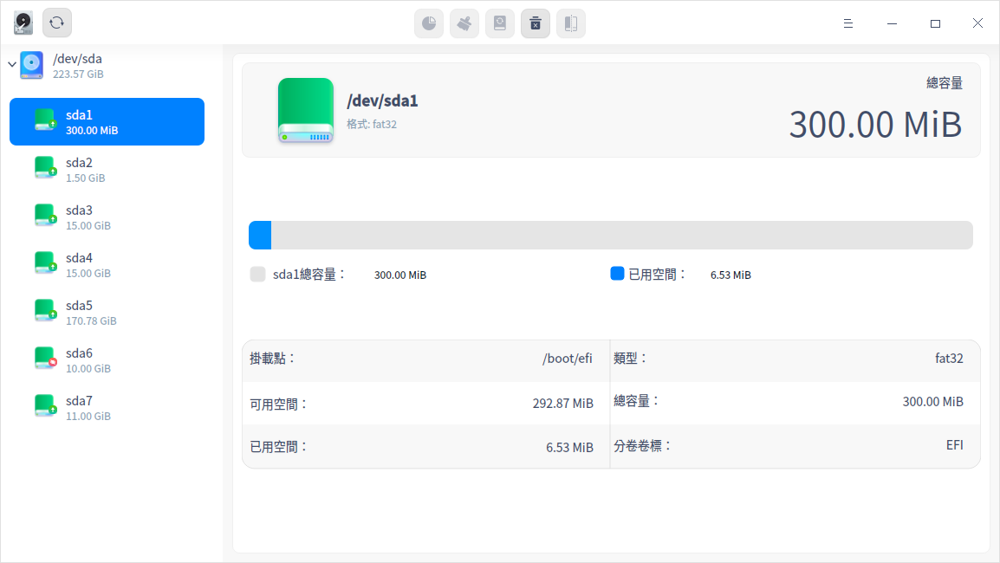
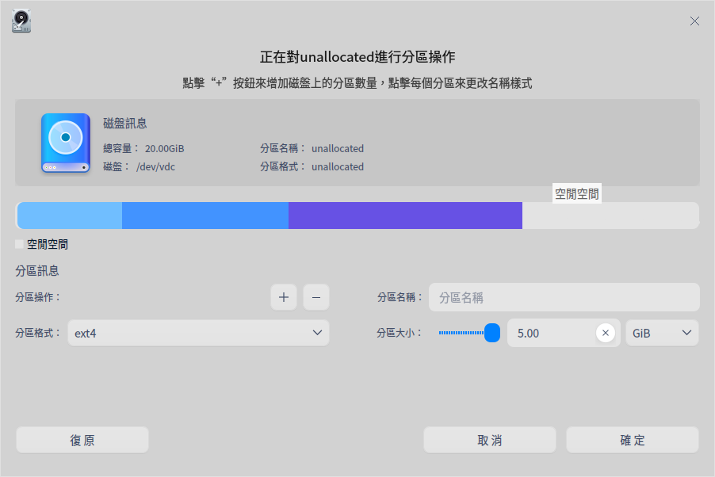
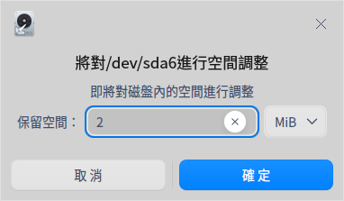
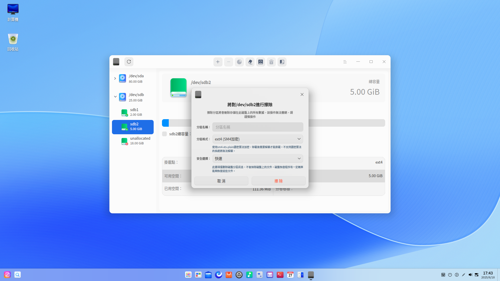
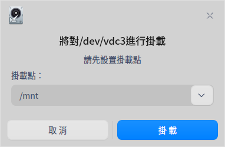
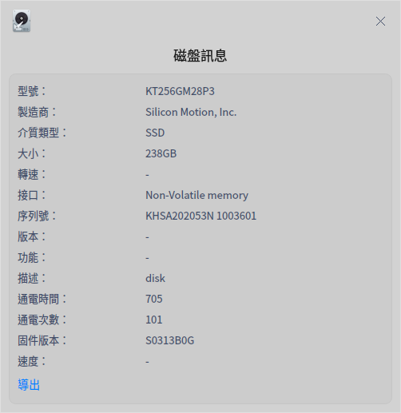
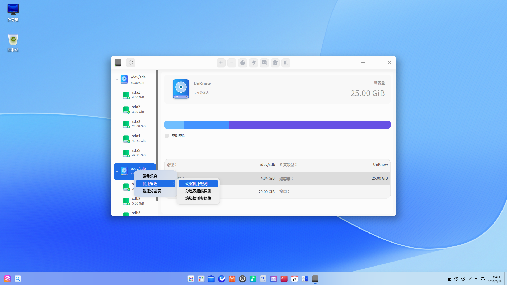
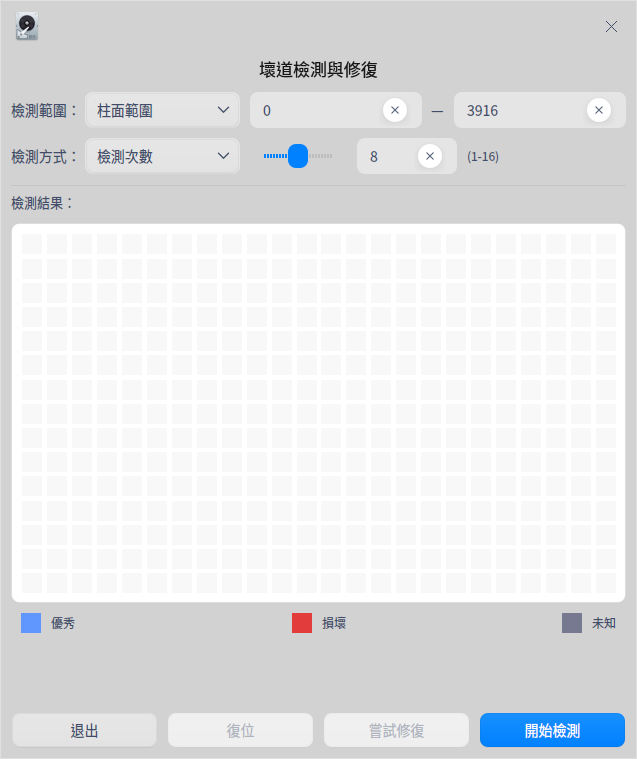
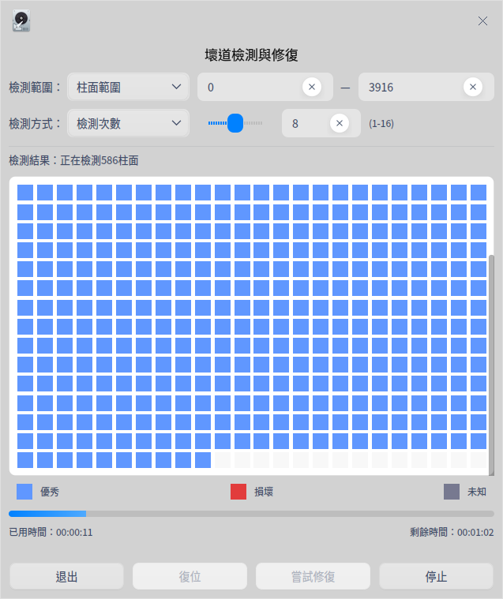

# 磁盤管理器|deepin-diskmanager|

## 概述

磁盤管理器是一款管理磁盤的工具，可幫助用戶進行磁盤分區管理、磁盤數據管理及磁盤健康管理。

## 使用入門

您可以通過以下方式運行或關閉磁盤管理器，或者創建快捷方式。

### 運行磁盤管理器

1. 單擊任務欄上的啟動器圖標  ，進入啟動器界面。

2. 上下滾動鼠標滾輪瀏覽或通過搜索，找到磁盤管理器圖標 ，單擊運行。彈出授權框，需要輸入系統登錄密碼進行認證。

3. 右鍵單擊 ，您可以：
   - 單擊 **傳送到桌面**，在桌面創建快捷方式。

   - 單擊 **傳送到任務欄**，將應用程序固定到任務欄。

   - 單擊 **加至開機啟動**，將應用程序添加到開機啟動項，在電腦開機時自動運行該應用程序。

### 關閉磁盤管理器

- 在磁盤管理器界面，單擊   ，退出磁盤管理器。

- 右鍵單擊任務欄上的 ，選擇 **關閉所有** 來退出磁盤管理器。

- 在磁盤管理器界面單擊 ，選擇 **退出** 來退出磁盤管理器。

## 磁盤分區管理
磁盤管理器主界面顯示磁盤列表及其分區訊息，包括分區格式、分區總量、掛載點等詳細訊息。單擊刷新，可以刷新當前頁面訊息。還可以新建分區、調整分區空間、格式化、掛載及卸載分區等。

### 新建分區

1. 在磁盤管理器主界面，選中未分配的分區，並在頂部功能欄單擊分區按鈕 。

2. 彈出確認框，單擊 **確定** 後進入分區操作界面。在分區操作界面，可查看分區總容量、名稱、格式及所屬的磁盤訊息。

3. 在分區訊息區域填寫新分區名稱、分區大小，並選擇分區格式，然後單擊增加按鈕 。可新建多個分區，磁盤條形圖中會分段顯示每個分區及其名稱。在新建分區的過程中，單擊刪除按鈕 ，可刪除分區。

   >  注意：MSDOS分區最多只能創建4個分區；GPT分區最多一次性創建24個分區，最多可創建128個分區。創建新分區的空間不得小於52 MB，否則無法創建。

4. 創建完分區後，單擊 **確定** ，新建的分區會顯示在對應磁盤下。

5. 在新建分區的過程中會自動格式化該分區。若要正常使用新建分區，還需要手動掛載，詳細操作請參考 [掛載分區](#掛載分區) 。

  
### 空間調整

若分區空間太小 ，可以選擇調整空間，使用前提是選中的分區處於卸載狀態。

1. 在磁盤管理器主界面，選中卸載狀態的分區，並在頂部功能欄單擊空間調整按鈕  。

2. 彈出空間調整界面，填寫需要擴容的大小，並單擊 **確定**。

&nbsp;&nbsp;&nbsp;&nbsp;&nbsp;&nbsp;&nbsp;&nbsp;&nbsp;&nbsp;&nbsp;&nbsp;&nbsp;

3. 擴容完成後，可查看分區的總容量。

   >  說明：只有與空閒分區相鄰的分區才可以擴容分區容量。

## 磁盤數據管理

### 格式化分區

格式化主要是更改分區格式時使用的，格式化分區後，將會刪除該分區儲存在磁盤上的所有數據，且無法撤銷，請謹慎操作。

使用前提：選中的分區為空閒分區，處於卸載狀態。

1. 在磁盤管理器主界面，選中一個分區，並在頂部功能欄單擊格式化按鈕  。

2. 彈出格式化操作界面，填寫分區的名稱，並選擇分區格式。

&nbsp;&nbsp;&nbsp;&nbsp;&nbsp;&nbsp;&nbsp;&nbsp;&nbsp;&nbsp;&nbsp;&nbsp;&nbsp;

3. 確定後，單擊 **格式化** 即可。

### 掛載分區

1. 在磁盤管理器主界面，選中未掛載的分區，並在頂部功能欄單擊掛載按鈕  。

2. 彈出掛載操作界面，選擇或創建掛載點後，單擊 **掛載** 即可。

&nbsp;&nbsp;&nbsp;&nbsp;&nbsp;&nbsp;&nbsp;&nbsp;&nbsp;&nbsp;&nbsp;&nbsp;&nbsp;

>  注意：一個分區掛載在一個已存在的目錄上，這個目錄可以不為空，但掛載後這個目錄下以前的內容將不可用，請謹慎操作。

### 卸載分區

若要修改分區的掛載點，可先卸載，再重新掛載。

1. 在磁盤管理器主界面，選中一個分區，並在頂部功能欄單擊卸載按鈕   。

2. 彈出確認框，確認無正在運行的程序後，單擊 **卸載**  即可。

>  注意：卸載系統盤可能會引起系統崩潰，請勿操作。

### 刪除分區

刪除分區後，該分區中的所有文件都會丟失，請謹慎操作。

使用前提：選中的分區處於卸載狀態。

1. 在磁盤管理器主界面，選中一個分區，並單擊右鍵。

2. 選擇 **刪除分區** 後彈出確認框，單擊 **刪除**，該分區在對應磁盤下消失。

## 磁盤健康管理

### 磁盤訊息

1. 在磁盤管理器主界面，選中磁盤，並單擊右鍵，選擇 **磁盤訊息**。

2. 可查看磁盤的序列號、設備模型、用戶容量及轉速等訊息。

&nbsp;&nbsp;&nbsp;&nbsp;&nbsp;&nbsp;&nbsp;&nbsp;&nbsp;&nbsp;&nbsp;&nbsp;&nbsp;
3. 單擊 **導出**，還可以將磁盤訊息導出到指定的文件夾。

### 健康管理

**硬盤健康監測**

1. 在磁盤管理器主界面，選中磁盤，並單擊右鍵，選擇 **健康管理 > 硬盤健康監測** 。

2. 可查看磁盤的健康狀態是否良好，當前的溫度及各屬性的狀態。

&nbsp;&nbsp;&nbsp;&nbsp;&nbsp;&nbsp;&nbsp;&nbsp;&nbsp;&nbsp;&nbsp;&nbsp;&nbsp;
3. 單擊 **導出**，還可以將硬盤健康檢測訊息導出到指定的文件夾。

**分區表錯誤檢測**

1. 在磁盤管理器主界面，選中磁盤，並單擊右鍵，選擇 **健康管理 > 分區表錯誤檢測** 。

2. 若分區表沒有錯誤，則彈出 「分區表檢測正常」提示；若分區表有錯誤，會彈出錯誤報告。

**壞道檢測與修復**

磁盤壞道是磁盤使用過程中常見的問題，需要定期檢測與修復。

1. 在磁盤管理器主界面，選中磁盤，並單擊右鍵，選擇 **健康管理 > 壞道檢測與修復** 。

2. 在壞道檢測與修復界面，您可以設置檢測範圍和檢測方式，然後單擊 **開始檢測**。

   

3. 在檢測過程中，您可以單擊 **停止** 隨時停止對應的磁盤檢測，再單擊 **繼續** 後，繼續對應的磁盤檢測。

   

4. 檢測完成後，可根據檢測結果做以下操作。

      無壞道：可以直接退出檢測界面。

      有壞道：單擊 **嘗試修復** 進行壞道修復。

      >  注意：修復壞磁道會破壞壞磁道及其附近磁道上的文件數據，請先做好數據備份。

   還可以單擊 **復位**，清空現有的所有磁盤檢測數據，顯示剛開始進入磁盤時的狀態。

### 新建分區表

新建分區表有兩種情況：

- 當前磁盤是正常的但是無分區表，則無法對分區進行操作，新建分區表後就可以執行對該分區的操作。
- 當前磁盤有分區表，如MSDOS分區表，新建分區表後可以切換為GPT分區表。

使用前提：卸載該磁盤中的所有分區。

1. 在磁盤管理器主界面，選中磁盤，並單擊右鍵，選擇 **新建分區表**。
2. 選擇GPT或MSDOS磁盤分區後，單擊 **新建** 即可。

>  注意：新建分區表後將會合併當前磁盤所有分區，丟失所有數據，請先做好數據備份。

## 主菜單

在主菜單中，您可以進行切換窗口主題，查看幫助手冊等操作。

### 主題

窗口主題包含淺色主題、深色主題和系統主題。

1. 在磁盤管理器界面，單擊。
2. 單擊 **主題**，選擇一個主題顏色。

### 幫助

1. 在磁盤管理器界面，單擊 。
2. 單擊 **幫助**，查看幫助手冊，進一步了解和使用磁盤管理器。

### 關於

1. 在磁盤管理器界面，單擊 。
2. 單擊 **關於**，查看磁盤管理器的版本和介紹。

### 退出

1. 在磁盤管理器界面，單擊 。
2. 單擊 **退出**。