# 磁盤管理器|deepin-diskmanager|

## 概述

磁盤管理器是一款管理磁盤的工具，可以幫助用戶快速的查看硬碟中各個分區的基本訊息，還可以創建並管理邏輯卷。

## 使用入門

您可以通過以下方式運行或關閉磁盤管理器，或者創建快捷方式。

### 運行磁盤管理器

1. 單擊任務欄上的啟動器圖標  ，進入啟動器界面。

2. 上下滾動鼠標滾輪瀏覽或通過搜索，找到磁盤管理器圖標 ，單擊運行。彈出授權框，需要輸入系統登錄密碼進行認證。

   

3. 右鍵單擊 ，您可以：
   - 單擊 **傳送到桌面**，在桌面創建快捷方式。

   - 單擊 **傳送到任務欄**，將應用程序固定到任務欄。

   - 單擊 **加至開機啟動**，將應用程序添加到開機啟動項，在電腦開機時自動運行該應用程序。

### 關閉磁盤管理器

- 在磁盤管理器界面，單擊   ，退出磁盤管理器。

- 右鍵單擊任務欄上的 ，選擇 **關閉所有** 來退出磁盤管理器。

- 在磁盤管理器界面單擊 ，選擇 **退出** 來退出磁盤管理器。

## 操作介紹

### 磁盤管理

打開磁盤管理器，可以查看磁盤訊息、健康狀態，新建分區表等。對於分區，則可以新建分區、調整分區空間、擦除、掛載及卸載分區等。

> 注意：

- 在操作的過程中如果強制退出磁盤管理器，可能會導致磁盤管理器異常，請謹慎操作。

- 如果系統盤某分區為mbr擴展分區、邏輯分區或邏輯卷，請謹慎對此分區進行操作，以免引起系統崩潰。

#### 磁盤訊息

1. 在磁盘管理器界面，左侧边栏显示磁盘列表及分区信息。单击刷新按钮，可以刷新当前页面信息。

   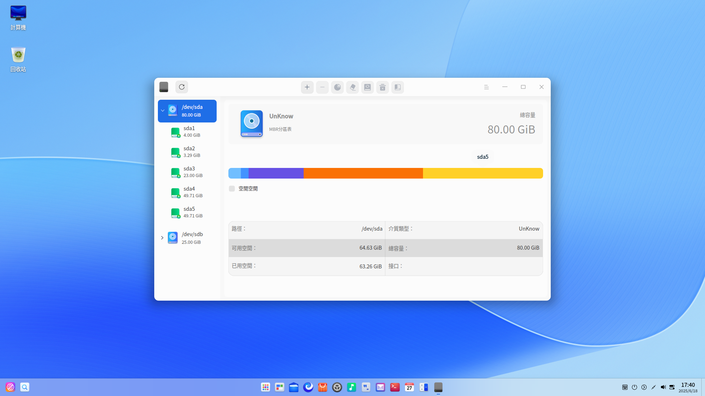

2. 選中磁盤後單擊右鍵，選擇 **磁盤訊息**，可以查看磁盤的型號、製造商、介質類型、大小、接口等訊息。

   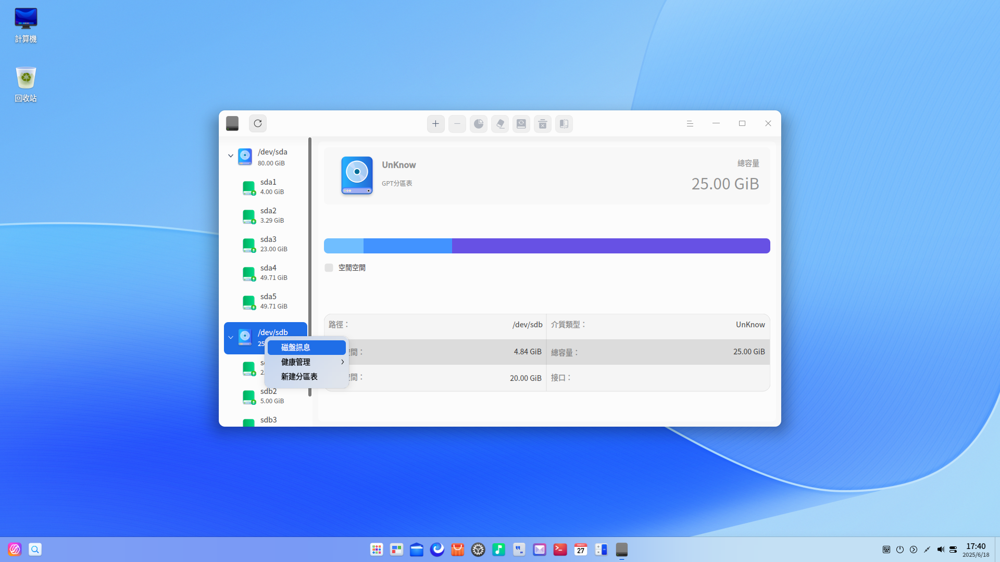

3. 單擊 **導出**，還可以將磁盤訊息導出到指定的文件夾。

#### 新建分區表

新建分區表有兩種情況：

- 當前磁盤是正常的但是無分區表，則無法對分區進行操作，新建分區表後就可以執行對該分區的操作。
- 當前磁盤有分區表，如MSDOS分區表，新建分區表後可以切換為GPT分區表。

使用前提：卸載該磁盤中的所有分區。

1. 在磁盤管理器界面，選中磁盤，並單擊右鍵，選擇 **新建分區表**。
2. 選擇GPT或MSDOS磁盤分區後，單擊 **新建** 即可。

>  注意：新建分區表後將會合併當前磁盤所有分區，丟失所有數據，請先做好數據備份。

#### 健康管理

**硬盤健康監測**

1. 在磁盤管理器界面，選中磁盤，並單擊右鍵，選擇 **健康管理 > 硬盤健康監測** 。

2. 可查看磁盤的健康狀態是否良好，當前的溫度及各屬性的狀態。

   
   &nbsp;&nbsp;&nbsp;&nbsp;&nbsp;&nbsp;&nbsp;&nbsp;&nbsp;&nbsp;&nbsp;&nbsp;&nbsp;

3. 單擊 **導出**，還可以將硬盤健康檢測訊息導出到指定的文件夾。

**分區表錯誤檢測**

1. 在磁盤管理器界面，選中磁盤，並單擊右鍵，選擇 **健康管理 > 分區表錯誤檢測** 。

2. 若分區表沒有錯誤，則彈出 「分區表檢測正常」提示；若分區表有錯誤，會彈出錯誤報告。

**壞道檢測與修復**

磁盤壞道是磁盤使用過程中常見的問題，需要定期檢測與修復。

1. 在磁盤管理器界面，選中磁盤，並單擊右鍵，選擇 **健康管理 > 壞道檢測與修復** 。

2. 在壞道檢測與修復界面，可以設置檢測範圍和檢測方式，然後單擊 **開始檢測**。

   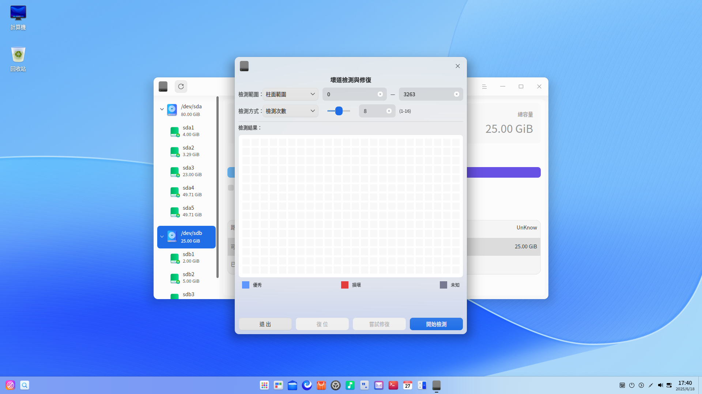

3. 在檢測過程中，可以單擊 **停止** 隨時停止對應的磁盤檢測，再單擊 **繼續** 後，繼續對應的磁盤檢測。

   

4. 檢測完成後，根據檢測結果做以下操作。

   無壞道：可以直接退出檢測界面。

   有壞道：單擊 **嘗試修復** 進行壞道修復。

   >  注意：修復壞磁道會破壞壞磁道及其附近磁道上的文件數據，請先做好數據備份。

   還可以單擊 **復位**，清空現有的所有磁盤檢測數據，顯示剛開始進入磁盤時的狀態。

#### 新建分區

1. 在磁盤管理器界面，選中未分配的分區，並在頂部功能欄單擊分區按鈕 。

2. 彈出確認框，單擊 **確定** 後進入分區操作界面，可以查看分區總容量、名稱、格式及所屬的磁盤訊息。

3. 在分區訊息區域填寫新分區名稱、分區大小，並選擇分區格式，當前支持AES/SM4文件加密。

   - 不加密：創建新分區的空間必須大於52 MiB，否則無法創建。
   
   - AES/SM4文件加密：創建新分區的空間必須大於100MiB，系統盤不可進行加密。
   
   >  注意：MSDOS分區最多只能創建4個分區；GPT分區最多一次性創建24個分區，最多可創建128個分區。
   
   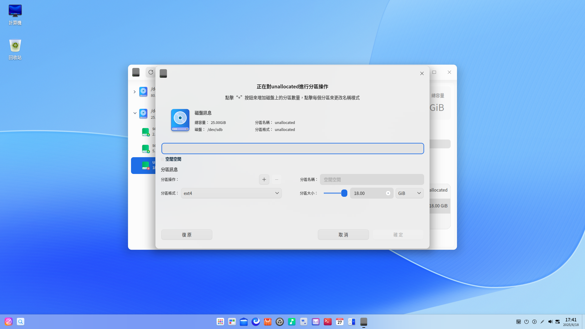
   
3. 如果選擇了文件加密，單擊增加按鈕 ，彈出設置密碼窗口。輸入密碼和密碼提示，單擊 **確定**。

   - 密碼不可重置，也不可在線找回，請自行備份。
   - 密碼：密碼長度為1～256個字符，由英文、數字或符號組成
   - 密碼提示：最多可以輸入50個字符，且不可與密碼完全一致。
   
   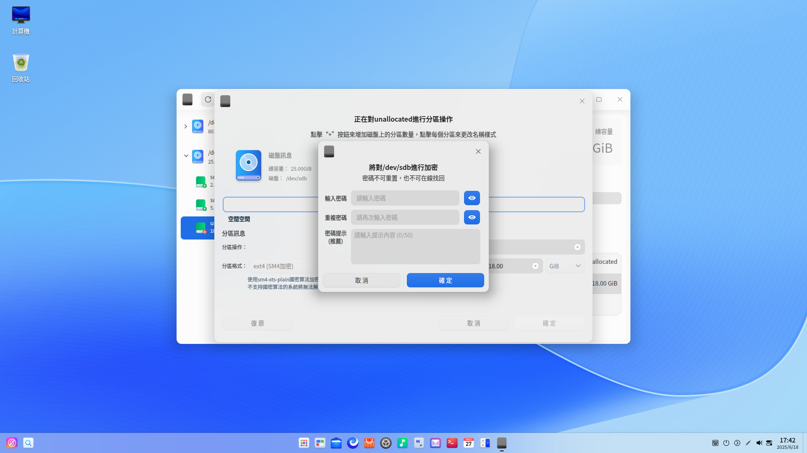
   
5. 新建的分區會分段顯示在條形圖中，可以新建多個分區。選中某個分區，單擊刪除按鈕 ，則可以刪除分區。

   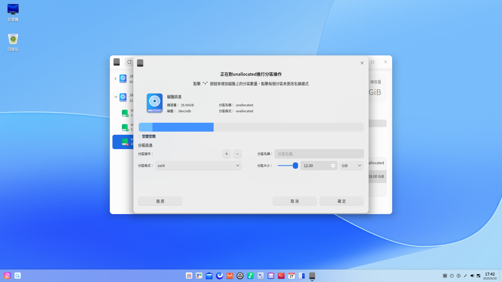
   
5. 創建完分區後，單擊 **確定** ，新建的分區會顯示在對應磁盤下。

7. 在新建分區的過程中會自動格式化該分區。若要正常使用新建分區，還需要手動掛載，詳細操作請參考 [掛載分區](#掛載分區) 。

   > 說明：如果新建的分區使用了AES/SM4加密，需要解鎖後才能掛載。對於SM4加密的分區，不支持國密算法的系統將無法解鎖。

#### 空間調整

對於未加密、卸載狀態的分區，可以進行空間調整。

1. 在磁盤管理器界面，選中卸載狀態的分區，並在頂部功能欄單擊空間調整按鈕  。

2. 彈出空間調整窗口，填寫調整後的空間大小。

   - 擴展空間：當前支持向下擴展空間，如果選中的分區下面相鄰的是空閒分區，則擴展後的空間不能大於當前空間和空閒分區之和。如果選中的分區下面無空閒分區，則無法擴展。

   - 壓縮空間：建議先對分區數據進行備份再進行操作。

   

3. 擴容完成後，可以查看空間調整後的分區。

   >  說明：FAT32文件系統不支持壓縮空間。

#### 擦除磁盤或分區

對於處於卸載狀態的磁盤或分區，可以進行擦除操作。通過擦除的方式將加密的文件系統修改為非加密文件系統。

1. 在磁盤管理器界面，選中一個磁盤或分區，並在頂部功能欄單擊擦除按鈕  。

2. 彈出擦除操作窗口，填寫分區名稱、分區格式和安全選擇。其中分區格式支持AES/SM4加密，安全選擇有快速、安全、高級三個選項，默認為「快速」。

   - 快速：僅擦除原文件系統標記，真正的數據會保留在磁盤上，通過磁盤恢復工具可能會恢復數據。

   - 安全：符合 NIST 800-88 的1次安全擦除。它會在整個磁盤中寫入0、1和隨機數據一次，擦除後將無法恢復磁盤上的文件，且處理過程較慢。

   - 高級：提供兩種磁盤擦除處理標準，分別為DoD 5220.22-M和Gutmann。會多次將0、1和隨機數據寫到整個磁盤。您可以定義擦除磁盤並改寫數據的次數，處理過程會非常緩慢。

   > 說明：由於DoD 5220.22-M和Gutmann數據擦除標準不支持擦除固態硬碟（SSD），所以如果設備類型為固態硬碟（SSD）時，安全選擇下拉框僅顯示快速和安全兩個選項。
   
   

3. 單擊 **擦除**。如果選擇了加密，則需要設置密碼，擦除完成後會自動掛載。

#### 掛載分區

AES/SM4加密的分區，卸載後需要解鎖才能掛載。對於SM4加密的分區，不支持國密算法的系統將無法解鎖。

1. 在磁盤管理器界面，選中未掛載的分區，並在頂部功能欄單擊掛載按鈕  。

2. 彈出掛載操作窗口，選擇或創建掛載點後，單擊 **掛載** 即可。

   

>  注意：一個分區掛載在一個已存在的目錄上，這個目錄可以不為空，但掛載後這個目錄下以前的內容將不可用，請謹慎操作。

#### 卸載分區

若要修改分區的掛載點，可先卸載，再重新掛載。

1. 在磁盤管理器界面，選中一個分區，並在頂部功能欄單擊卸載按鈕   。

2. 彈出確認框，確認無正在運行的程序後，單擊 **卸載**  即可。

>  注意：卸載系統盤可能會引起系統崩潰，請勿操作。

#### 刪除分區

刪除分區後，該分區中的所有文件都會丟失，請謹慎操作。

2. 在磁盤管理器界面，選中一個處於卸載狀態的分區，並單擊右鍵。
2. 選擇 **刪除分區** 後彈出確認框，單擊 **刪除**，該分區在對應磁盤下消失。

### 邏輯卷管理

邏輯卷管理是建立在磁盤和分區之上的一個邏輯層，可以創建和管理邏輯卷，而不是直接使用物理硬碟，從而提高磁盤分區管理的靈活性。

#### 創建邏輯卷組

1. 在磁盤管理器界面，單擊創建邏輯卷組按鈕，彈出提示窗口。創建邏輯卷會對原分區文件系統格式化，請先做好數據備份。

2. 單擊 **確定**，彈出創建邏輯卷組窗口，顯示所有可用的磁盤和分區，不顯示的磁盤和分區包括：

   - 啟動分區所在磁盤
   - 只讀模式的磁盤

   - 已加入其他邏輯卷的磁盤或分區

   - 已經掛載的分區
   - 不能創建新分區的磁盤空閒空間

   - 分區表錯誤的磁盤
   - 小於100MiB空間的磁盤或分區

   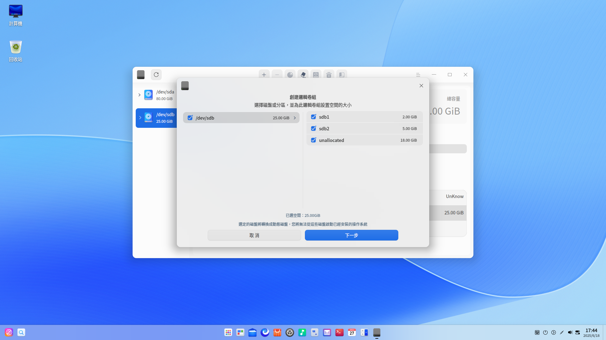

3. 自行選擇磁盤和分區後，單擊 **下一步**。

4. 在創建邏輯卷組界面，頂部會顯示已選擇的磁盤或分區，單擊刪除按鈕可以移除磁盤或分區，單擊添加按鈕則可以再次添加。當所選分區為空閒分區或者所選磁盤不存在分區表時，底部則會顯示設置卷組空間的範圍，可以在設置範圍內自定義空間。

   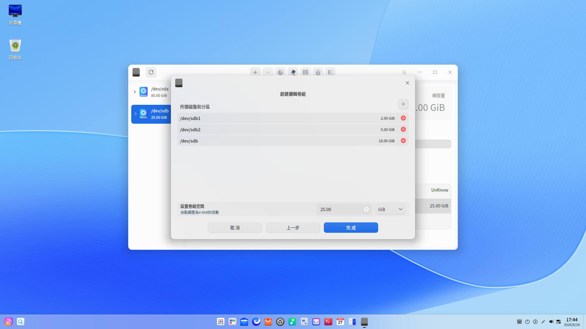

5. 單擊 **完成**，新創建的邏輯卷組會顯示在左側邊欄，默認名稱為vg01、vg02，依次類推。

   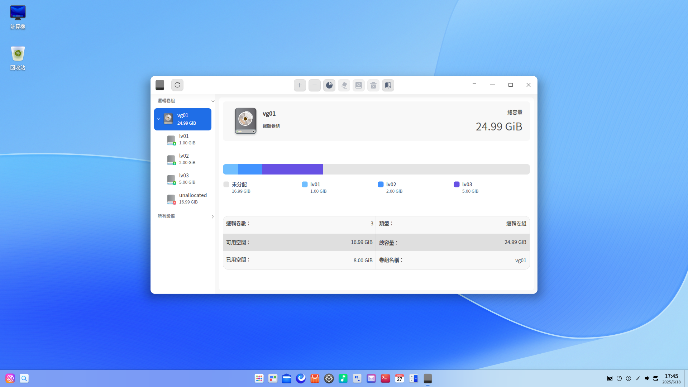

#### 創建邏輯卷

1. 選中一個有空閒空間的邏輯卷組，並在頂部功能欄單擊創建邏輯卷按鈕 。

2. 彈出確認框，單擊 **確定** 後進入創建邏輯卷界面，可以查看卷組總容量、名稱等訊息。

3. 在邏輯卷訊息區域填寫邏輯卷大小，並選擇邏輯卷格式，當前支持AES/SM4文件加密。

   - 不加密：創建邏輯卷的空間不得小於4 MiB，且為4MiB的正整數倍。
   - AES/SM4加密：創建邏輯卷的空間必須大於100MiB。
   
3. 如果選擇了文件加密，單擊增加按鈕 ，彈出設置密碼窗口。輸入密碼和密碼提示，單擊 **確定**。

   - 密碼不可重置，也不可在線找回，請自行備份。
   - 密碼：密碼長度為1～256個字符，由英文、數字或符號組成。
   - 密碼提示：最多可以輸入50個字符，且不可與密碼完全一致。

4. 新建的邏輯卷會分段顯示在條形圖中，可以新建多個邏輯卷。選中某個邏輯卷，單擊刪除按鈕 ，則可以刪除邏輯卷。

   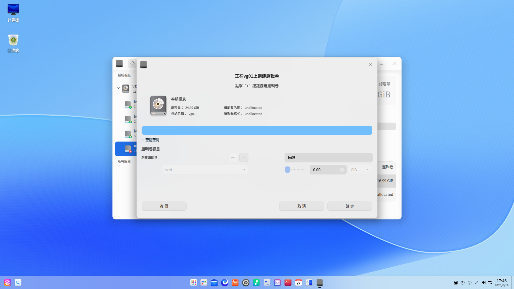

5. 操作完後單擊 **確定** ，在創建的過程中會進行格式化並自動掛載。

6. 新建的邏輯卷會顯示在對應邏輯卷組下。

   > 說明：如果新建的邏輯卷使用了AES/SM4加密，需要解鎖後才能掛載。對於SM4加密的邏輯卷，不支持國密算法的系統將無法解鎖。

#### 空間調整

結合使用需求，可以對邏輯卷和邏輯卷組進行空間調整，壓縮空間前建議先進行數據備份。

邏輯卷空間調整詳細操作請參考磁盤管理的 [空間調整](#空間調整)，FAT32格式的邏輯卷和加密邏輯卷不支持空間調整。

邏輯卷組空間調整操作如下所示：

1. 選中一個邏輯卷組，並在頂部功能欄單擊空間調整按鈕  。

2. 彈出空間調整窗口，顯示當前已有、可用的磁盤和分區，可以選擇擴展或壓縮空間。

   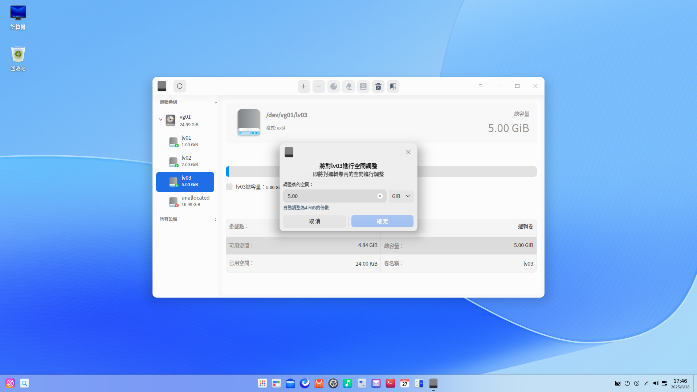

3. 勾選或去勾選對應的磁盤和分區後，單擊 **下一步**。

4. 在空間調整界面，頂部會顯示已選擇的磁盤或分區，單擊刪除按鈕可以移除磁盤或分區，單擊添加按鈕則可以再次添加。當所選分區為空閒分區或者所選磁盤不存在分區表時，底部則會顯示設置卷組空間的範圍，可以在設置範圍內自定義空間。

   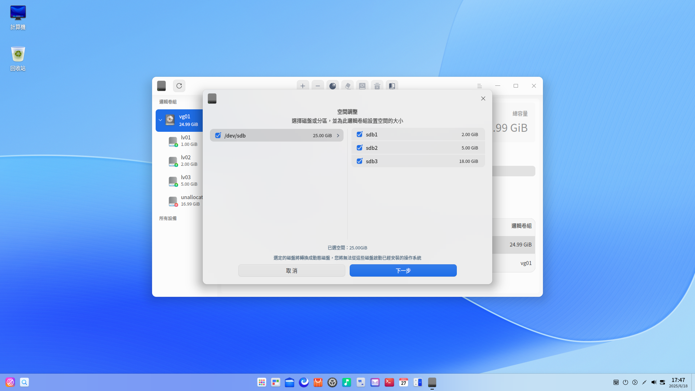

5. 單擊 **完成**，可以查看空間調整後的邏輯卷組。

#### 擦除邏輯卷

擦除邏輯卷與擦除分區操作類似，詳細操作請參考磁盤管理的 [擦除磁盤或分區](#擦除磁盤或分區)。

#### 掛載邏輯卷

掛載邏輯卷與掛載分區操作類似，詳細操作請參考磁盤管理的 [掛載分區](#掛載分區)。

#### 卸載邏輯卷

卸載邏輯卷與卸載分區操作類似，詳細操作請參考磁盤管理的 [卸載分區](#卸載分區)。

#### 刪除邏輯卷

刪除後數據將無法恢復，請謹慎操作。

使用前提：邏輯卷處於卸載狀態。

1. 選中一個邏輯卷，單擊右鍵並選擇 **刪除邏輯卷**，或單擊頂部功能欄的刪除按鈕。
2. 確認後，單擊 **刪除**，刪除的邏輯卷空間會被合入到所屬邏輯卷組中的空閒空間。

#### 刪除邏輯卷組

刪除後數據將無法恢復，請謹慎操作。

使用前提：該邏輯卷組下的所有邏輯卷處於卸載狀態。

1. 選中一個邏輯卷組，單擊右鍵並選擇 **刪除邏輯卷組**，或單擊頂部功能欄的刪除按鈕。
2. 確認後，單擊 **刪除**。

#### 刪除物理卷

1. 對於已添加到邏輯卷組的磁盤或分區，選中需要刪除的對象，單擊頂部功能欄的刪除按鈕。
2. 刪除物理卷後，其包含的所有文件將會丟失，請謹慎操作。確認後，單擊 **刪除**。
3. 如果邏輯卷組中剩餘的空間不小於待刪除的物理卷空間，可以正常刪除。如果邏輯卷組中剩餘的空間小於待刪除的物理卷空間，則無法正常刪除。建議先刪除對應的邏輯卷，再選擇刪除物理卷。

## 主菜單

在主菜單中，可以切換窗口主題，查看幫助手冊等操作。

### 主題

窗口主題包含淺色主題、深色主題和系統主題。

1. 在磁盤管理器界面，單擊。
2. 單擊 **主題**，選擇一個主題顏色。

### 幫助

1. 在磁盤管理器界面，單擊 。
2. 單擊 **幫助**，查看幫助手冊，進一步了解和使用磁盤管理器。

### 關於

1. 在磁盤管理器界面，單擊 。
2. 單擊 **關於**，查看磁盤管理器的版本和介紹。

### 退出

1. 在磁盤管理器界面，單擊 。
2. 單擊 **退出**。