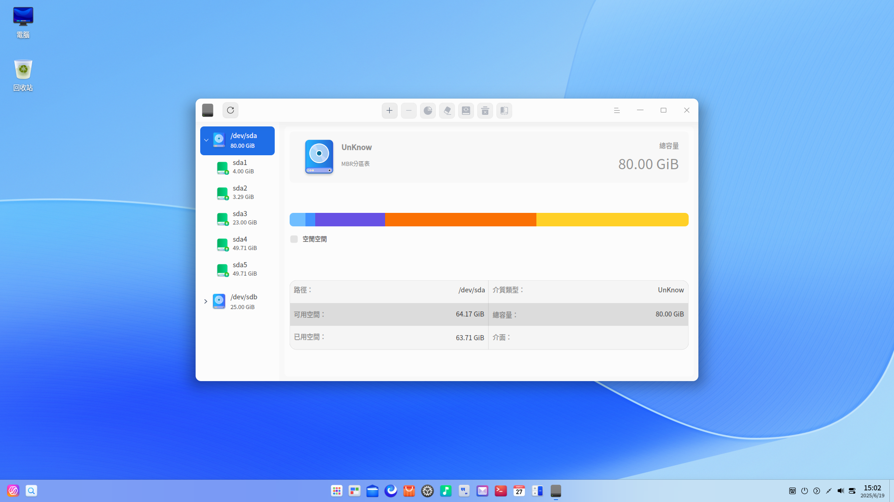
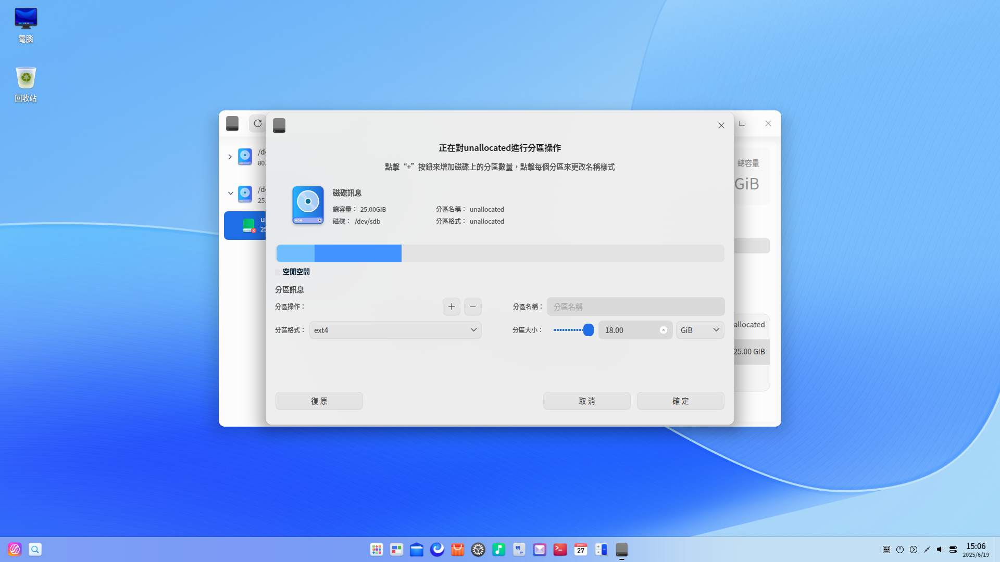
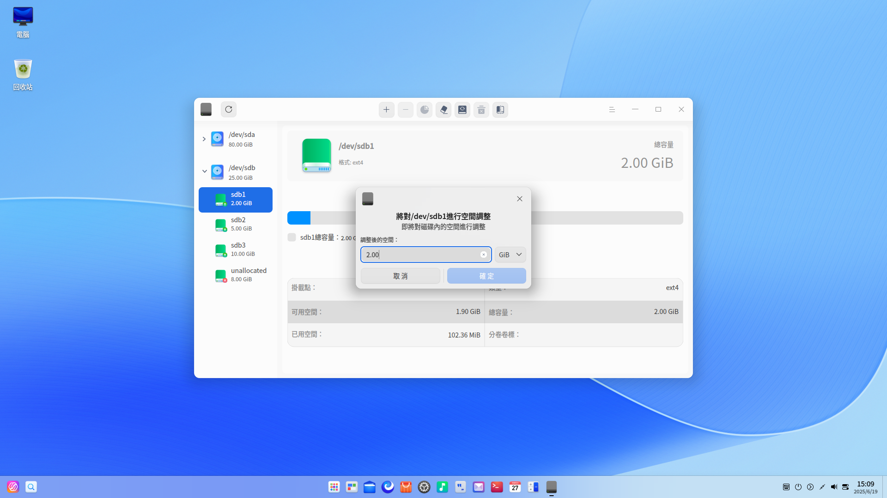
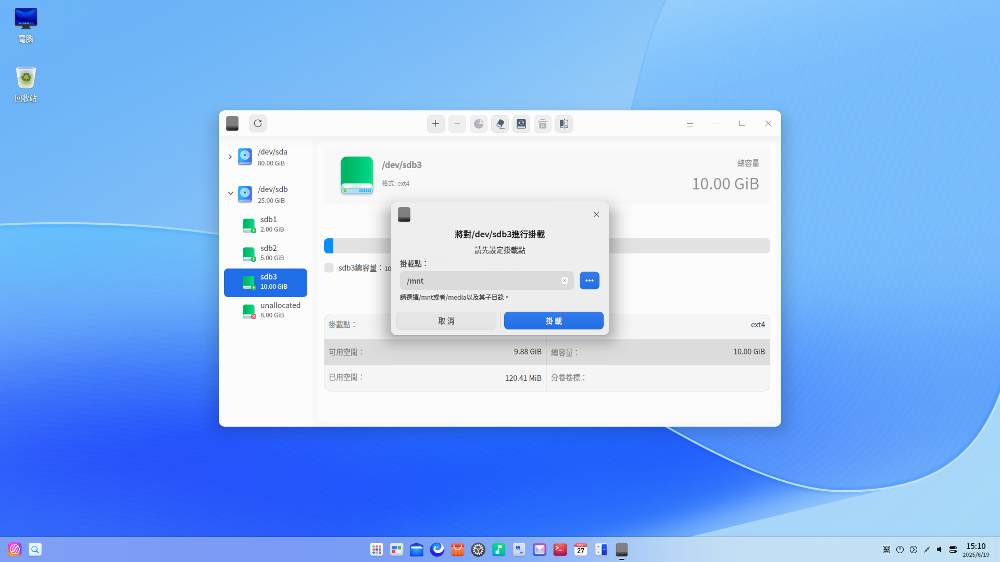

# 磁碟管理器|deepin-diskmanager|

## 概述

磁碟管理器是一款管理磁碟的工具，可幫助使用者進行磁碟分區管理、磁碟資料管理及磁碟健康管理。

## 使用入門

您可以透過以下方式執行或關閉磁碟管理器，或者建立捷徑。

### 執行磁碟管理器

1. 單擊任務欄上的  進入啟動器介面。

2. 上下滾動滑鼠滾輪瀏覽或透過搜尋找到「磁碟管理器」按鈕 ，單擊開啟。彈出授權框，需要輸入系統登入密碼認證。

3. 右鍵單擊 ，您可以：
   - 單擊 **建立桌面捷徑**，在桌面建立捷徑。
   - 單擊 **釘選到Dock**，將應用程式固定到Dock。
   - 單擊 **開機啟動**，將應用程式添加到開機啟動項，在電腦開機時自動執行該應用程式。

### 關閉磁碟管理器

- 在磁碟管理器介面，單擊  ，關閉磁碟管理器。
- 右鍵單擊任務欄上的  圖示，選擇 **全部關閉** 來關閉磁碟管理器。
- 在磁碟管理器介面單擊 ，選擇 **離開** 來關閉磁碟管理器。

## 磁碟分區管理

磁碟管理器主介面顯示磁碟列表及其分區訊息，包括分區格式、分區總量、掛載點等詳細訊息。單擊重新整理，可以重新整理目前頁面。還可以建立分區、分區空間調整、格式化、掛載及移除等操作。

>   注意：
>
> - 在操作的過程中如果強制退出磁碟管理器，可能會導致磁碟管理器異常，請謹慎操作。                                
> - 如果系統盤某分區為mbr擴展分區、邏輯分區或邏輯卷，請謹慎對此分區進行操作，以免引起系統崩潰。

### 建立分區

1. 在磁碟管理器主介面，選中未分配的分區，並在頂部功能欄單擊分區按鈕 。

2. 彈出確認框，單擊 **確定** 後進入分區操作介面。在分區操作介面，可查看分區總容量、名稱、格式及所屬的磁碟訊息。

3. 在分區訊息區域填寫新分區名稱、分區大小，並選擇分區格式，然後單擊增加按鈕。可建立多個分區，磁碟條形圖中會分段顯示每個分區及其名稱。在建立分區的過程中，單擊 刪除按鈕 ，可刪除分區。

&nbsp;&nbsp;&nbsp;&nbsp;&nbsp;&nbsp;&nbsp;&nbsp;&nbsp;&nbsp;&nbsp;&nbsp;&nbsp;
>  注意：msdos分區最多只能建立4個；gpt分區最多一次性可建立24個，最多可建立128個分區。新分區的空間不得小於52MB，否則無法建立。

4. 建立完分區後，單擊 **確定** ，建立的分區會顯示在對應磁碟下。

5. 在新建分區的過程中會自動格式化該分區。若要正常使用新建分區，還需要手動掛載，詳細操作請參考 [掛載分區](#掛載分區) 。

  

### 空間調整

若分區空間太小 ，可以選擇調整空間，使用前提是選中的分區處於移除狀態。

1. 在磁碟管理器主介面，選中移除狀態的分區，並在頂部功能欄單擊空間調整按鈕 。

2. 彈出空間調整介面，填寫需要擴容的大小，並單擊 **確定**。

3. 擴容完成後，可查看總容量。

   >   說明：只有與空閒分區相鄰的分區才可以擴容分區容量。

## 磁碟資料管理

### 格式化分區

格式化主要用於更改分區格式。格式化分區後，將會刪除該分區儲存在磁碟上的所有資料，且無法復原，請謹慎操作。

使用前提：選中的分區為空閒分區，處於移除狀態。

1. 在磁碟管理器主介面，選中一個分區，並在頂部功能欄單擊格式化按鈕 。

2. 彈出格式化操作介面，填寫分區的名稱，並選擇分區格式。

3. 確定後，單擊 **格式化** 即可。

### 掛載分區

1. 在磁碟管理器主介面，選中未掛載的分區，並在頂部功能欄單擊掛載按鈕 。

2. 彈出掛載操作介面，選擇或建立掛載點後，單擊 **掛載** 即可。

   

>  注意：一個分區掛載在一個已存在的目錄上，這個目錄可以不為空，但掛載後這個目錄下以前的內容將不可用，請謹慎操作。

### 移除分區

若要修改分區的掛載點，可先移除，再重新掛載。

1. 在磁碟管理器主介面，選中一個分區，並在頂部功能欄單擊移除按鈕 。
2. 彈出確認框，確認無正在執行的程式後，單擊 **移除** 即可。

>  注意：移除系統盤可能會引起系統崩潰，請謹慎操作。

### 刪除分區

刪除分區後，該分區中的所有文件都會遺失，請謹慎操作。

使用前提：選中的分區處於移除狀態。

1. 在磁碟管理器主介面，選中一個分區，並單擊右鍵。

2. 選擇 **刪除分區** 後彈出確認框，單擊 **刪除**，該分區在對應磁碟下消失。

## 磁碟健康管理

### 磁碟訊息

1. 在磁碟管理器主介面，選中磁碟，並單擊右鍵，選擇 **磁碟訊息**。

2. 可查看磁碟的序號、裝置模型、使用者容量及轉速等訊息。

3. 單擊 **匯出**，還可以將磁碟訊息匯出到指定的資料夾。

### 健康管理

#### 硬碟健康監測

1. 在磁碟管理器主介面，選中磁碟，並單擊右鍵，選擇 **健康管理** > **硬碟健康監測** 。

2. 可查看硬碟的健康狀態是否良好，目前的溫度及各屬性的狀態。

3. 單擊 **匯出**，還可以將硬碟健康檢測訊息匯出到指定的資料夾。

#### 分區表錯誤檢測

1. 在磁碟管理器主介面，選中磁碟，並單擊右鍵，選擇 **健康管理** > **分區表錯誤檢測** 。
2. 若分區表沒有錯誤，則彈出 **分區表檢測正常** 提示；若分區表有錯誤，會彈出錯誤報告。

#### 壞道檢測與修復

磁碟壞道是磁碟使用過程中常見的問題，需要定期檢測與修復。

1. 在磁碟管理器主介面，選中磁碟，並單擊右鍵，選擇 **健康管理 > 壞道檢測與修復** 。

2. 在壞道檢測與修復介面，您可以設定檢測範圍和檢測方式，然後單擊 **開始檢測**。

   

3. 在檢測過程中，您可以單擊 **停止** 隨時停止對應的磁碟檢測，再單擊 **繼續** 後，繼續對應的磁碟檢測。

   

4. 檢測完成後，可根據檢測結果做以下操作。

   無壞道：可以直接退出檢測介面。

   有壞道：單擊 **嘗試修復** 進行壞道修復。

   >  注意：修復壞磁道會破壞壞磁道及其附近磁道上的文件資料，請先做好資料備份。

還可以單擊 **復位**，清空現有的所有磁碟檢測資料，顯示剛開始進入磁碟時的狀態。

### 建立分區表

建立分區表有兩種情況：

- 目前磁碟是正常的但是無分區表，則無法對分區進行操作，建立分區表後就可以執行對該分區的操作。
- 目前磁碟有分區表，如msdos分區表，建立分區表後可以切換為gpt分區表。

使用前提：移除該磁碟中的所有分區。

1. 在磁碟管理器主介面，選中磁碟，並單擊右鍵，選擇 **建立分區表**。
2. 選擇GPT或MSDOS磁碟分區後，單擊 **建立** 即可。

>  注意：建立分區表後將會合併目前磁碟所有分區，遺失所有資料，請先做好資料備份。

## 主選單

在主選單中，您可以進行切換視窗主題，查看說明手冊等操作。

### 主題

視窗主題包含亮色主題、暗色主題和系統主題。

1. 在磁碟管理器介面，單擊 。
2. 單擊 **主題**，選擇一個主題顏色。

### 說明

1. 在磁碟管理器介面，單擊 。
2. 單擊 **說明**，查看磁碟管理器的說明手冊，進一步了解和使用磁碟管理器。

### 關於

1. 在磁碟管理器介面，單擊 。
2. 單擊 **關於**，查看磁碟管理器的版本和介紹。

### 離開

1. 在磁碟管理器介面，單擊 。
2. 單擊 **離開**。